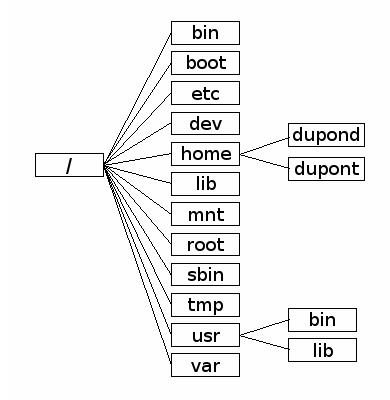
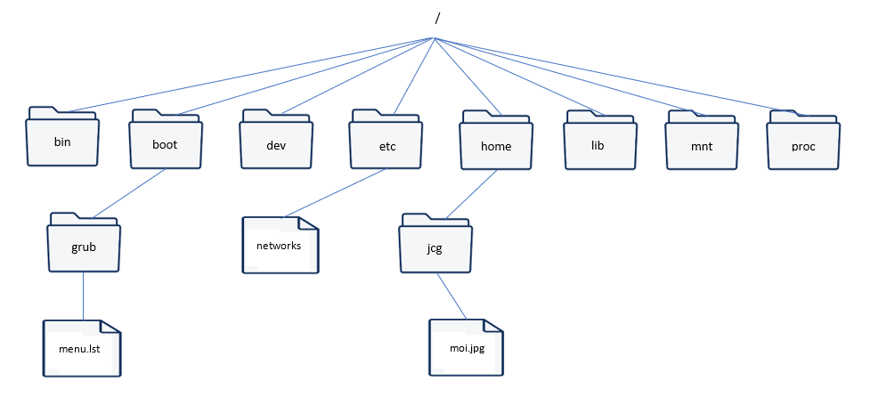

# Devoir surveillé - Systèmes d'exploitation

## Exercice 1 - Questions de cours (5 poinbs)
1. Définir "Système d'exploitation"
2. Quel est le rôle principal d'un système d'exploitation ?
3. Donner le nom d'au moins trois système d'exploitation.
4. Quel est le langage de programmation le plus proche du processeur ?
5. Expliquer quelles sont les différences entre un logiciel libre et un logiciel propriétaire.

## Exercice 2 - Comprendre les commandes (7 points)
On considère le système de fichier suivant :


1. Recopier l'arborescence de fichier
2. Lire les commandes suivantes et appliquer les modifications sur votre schéma

```bash
cd /home/dupont
mkdir compta
mkdir compta/2025
touch compta/2025/rapport.txt
cd compta/2025
mkdir ../2026
cp rapport.txt ../2026
rm rapport.txt
rmdir ../../dupond
```

## Exercice 3 - Ecrire les lignes de commandes (8 points)
On considère le système de fichier suivant :



On se situe dans le répertoire "jcg"

1. Ecrire le chemin absolu permettant de pointé vers le fichier "menu.lst"
2. Ecrire le chemin relatif permettant de pointé vers le fichier "moi.jpg"
3. Ecrire le chemin relatif permettant de pointé vers le fichier "networks"

Après chaque commande, on reprend la situation initial.

4. Quelle commande permet de se déplacer dans le répertoire lib ?
5. Quelle commande permet de supprimer le fichier moi.jpg ?
6. Quelle commande permet de créer un fichier "bonjour.txt" dans le répertoire etc ?
7. Quelle commande permet de créer un repértoire "cours" dans le répertoire courant ?
8. Quelle commande permet d'afficher le contenu détaillé du répertoire courant ?
9. Quelle commande permet de déplacer le fichier moi.jpg dans le répertoire home ?
10. Quelle commande permet de connaître le chemin absolu du répertoire courant ?
11. Quelle commande permet d'afficher le contenu du fichier "networks" ?
12. Quelle commande permet de connaître les informations concernant les cartes réseaux ? (adresse IP)
13. Quelle commande permet de tester la connexion avec l'ordinateur 192.168.1.20 ?
14. Quelle commande permet de modifier les droits des utilisateur sur le fichier "moi.jpg" de façon à ce que le propriétaire ai le droit de lire, modifier et exècuter le fichier, le groupe propriétaire ai le droit de lire et exècuter le fichier et que tous les autres utilisateur n'ai aucun droit sur le fichier.
15. Quelle commande permet de modifier le propriétaire de fichier "networks" pour que ce soit "root".
16. Si l'utilisateur qui lance la commande n'est pas le propriétaire du fichier, il aura une erreur "permission denied". Ecrire la commande qui lui permettrait de l'exècuter avec les droits adiministrateur.