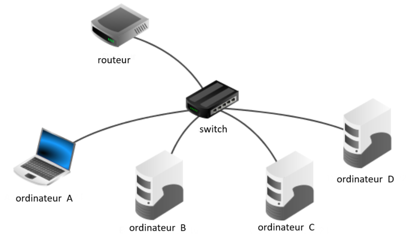

# Devoir 1 - Ecriture binaire et réseaux
## Exercice 1 : Réseaux (12 points)
1. **(2 points)** Expliquer le rôle des equipements réseaux suivants :
- Commutateur (ou switch)
- Routeur

On considère le réseau suivant :



Les adresses IP seront conformes à la nomre IPv4, à savoir composée de 4 octets. Elles prendront la forme ```X1.X2.X3.X4```, où ```X1```, ```X2```, ```X3``` et ```X4``` correspondent aux 4 octets convertis en notation binaire.

La notation CIDR ```X1.X2.X3.X4/n``` signifie que les ```n``` premiers bits de poids forts de l’adresse IP représentent la partie « réseau », les bits suivants représentent la partie « hôte ».

Toutes les adresses des hôtes connectés à un réseau local ont la même partie réseau et peuvent donc communiquer directement. 

- L’adresse IP dont tous les bits de la partie « hôte » sont à 0  est appelée « adresse du réseau ».
- L’adresse IP dont tous les bits de la partie « hôte » sont à 1 est appelée « adresse de broadcast ».

2. **(1 point)** ```10100100.10110010.XXXXXXXX.XXXXXXXX``` est la conversion en binaire de l’adresse ```164.178.2.13```.

    Terminer cette conversion en remplaçant les deux octets ‘XXXXXXXX’ par leur valeur binaire.

3. **(1 point)** Donner, en justifiant, l’adresse du réseau à laquelle appartient la machine dont l’adresse complète en notation CIDR est : 164.178.2.13/24

4. **(1 point)** Donner, en justifiant, l'adresse de broadcast de ce réseau.

5. **(1 point)** Combien de machines peut-on connecter sur ce réseau au maximum ?

6. **(1 point)** Donner les quatres couches du modèle TCP/IP. Expliquer le rôle de chacune d'entre-elle.

On considère le tableau suivant contenant les adresses IP de chacune des machines du réseau :
|Machine|Adresse|
|-------|-------|
|Routeur|	164.178.2.1|
|Ordinateur A|	164.178.2.11|
|Ordinateur B|	164.178.2.12|
|Ordinateur C|	164.178.2.13|
|Ordinateur D|	164.178.2.14|

On représente une adresse IP par un tuple de quatre valeurs représentant les quatre octets de l’adresse IP :

**Exemple :**  ```ip = (164, 178, 2, 13)```

7. **(2 points)** On souhaite créer une liste contenant les adresses IP de chacune des machines du réseau local. Écrire la liste adresses comportant les adresses IP des machines sur le réseau.

8.	**(3 points)** Écrire une fonction permettant d’ajouter une adresse IP à la liste si l’adresse est disponible (Elle n’est pas déjà dans la liste) et que celle-ci appartient bien au réseau.  

    La fonction renvoie ```True``` si l’ajout a eu lieu et False sinon. 

    **On considère pour cette fonction que le dernier octet correspond à la partie hôte et que les trois premiers correspondent à la partie réseau.**

```python
def add_ip(liste_ip, nex_ip):
    for ip in liste_ip:
        if new_ip[0] != ip[0] or ... or ...!
            # L'un des trois premiers octets est différents
            return ...
        elif ...
            # Le dernier octet est identique
            return ...
    liste_ip.append(...)
    return True
```

## Exercice 2 : Répresentation binaire
1. **(1 point)** On considère les deux nombres relatifs suivant représentés en binaire :
- 0100 0110
- 1001 0110

    Lequel de ces deux nombres est négatif ? Justifier votre réponse.

2. **(2 points)** Convertir ces deux nombres relatifs en binaire sur 8 bits :
- ```- 112```
- ```36```

3. **(2 points)** Convertir ces deux nombres relatifs en décimale :
- ```1111 1111```
- ```1000 0110```

4. **(1 point)** On considère le programme suivant :
```python
a = 0.1
b = 0.2
c = 0.3
print(a+b == c)
```
    Expliquer pourquoi ce programme n'affiche pas ```True``` ?

5. **(2 points)** Convertir ces nombres réels en binaire. 

    **On ne demande pas une représentation suivant la norme IEE-754, mais une représentation avec une virgule**

    **Exemple :** ```1,25 => 1,01```
- ```10,875```
- ```30,2```