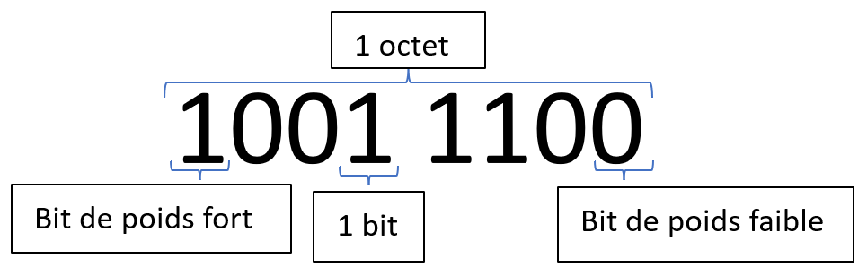
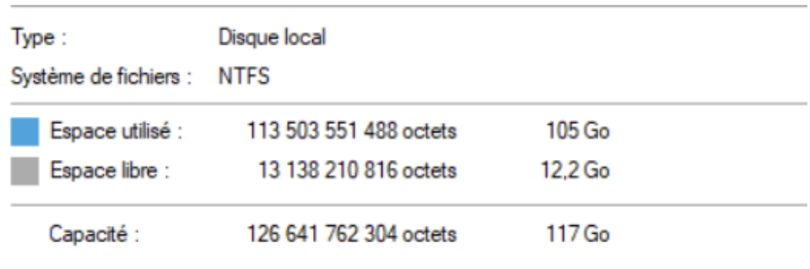

# Chapitre A.1  - Ecriture binaire

## I. Ecriture décimale
Dans la vie quotidienne, pour représenter les nombres on utilise 10 chiffres (de 0 à 9). On dit que l'on représente les nombres en **base 10**.
Cette représentation est appelé **écriture décimale**. 

La représentation des nombres en base 10 est une somme de puissance de 10. 

**Exemple :**

$1243 = 1000+200+40+3 ^1

$= 10^3+2\times10^2+4\times10^4+3\times10^0$

## II. Ecriture binaire 
En informatique, il n'est pas possible de représenter 10 chiffres. En effet, il n'existe de stocker que deux valeurs possibles (0 et 1).

Il faut donc trouver une une représentation qui ne contient que deux chiffres. Cette représentation **en base 2** est appelé **écriture binaire**.

> Pour différencier la base utilisé pour la représentation d'une valeur, on écrira la base utilisé en indice après la représentation
>
>**Exemple :**
>
>$(1010)_{2}$ est écrit en base 2 
>
>$(1010)_{10}$ est écrit en base 10

### A. Passer de la base 2 à la base 10
Tous la comme la représentation des nombres en base 10 est une somme de puissance de 10, la représentation en base 2 est une somme de puissance de 2.

**Exemple :**

$(1010)_2 = 1 \times 2^3 + 0 \times 2^2 + 1 \times 2^1 + 0 \times 2^0$

$= 1 \times 8 + 0 \times 4 + 1 \times 2 + 0 \times 1$

$= 8 + 2 = 10$

>Pour passer d'une représentation à une autre, il est primordiale de connaître les puissances de 2.
>|$2^0$|$2^1$|$2^2$|$2^3$|$2^4$|$2^5$|$2^6$|$2^7$|$2^8$|$2^9$|$2^{10}$|$2^{11}$|
>|-|-|-|-|-|-|-|-|-|-|-|-|
>|$1$|$2$|$4$|$8$|$16$|$32$|$64$|$128$|$256$|$512$|$1024$|$2048$|

## B. Passer de la base 10 à la base 2
Pour passer de la base 10 à la base 2, il existe plusieurs méthodes. 
### 1. Méthodes des divisions successives par 2
Pour obtenir la représentation en base 2 d'une valeur $n$ écrite en base 10, on réalise la division euclidienne de $n$ par 2. Le reste correspondra au chiffre le plus à droite de notre représentation binaire. Ensuite on divise le résultat de notre calcul à nouveau par 2, le reste correspond au deuxième chiffre de la représentation binaire. On continue tant que le résultat est différent de 0.

**Exemple :**

On souhaite obtenir la représentation en base 2 de $(35)_2$.

- $35 = 17 \times 2 + 1$
- $17 = 8 \times 2 + 1$
- $8 = 4 \times 2 + 0$
- $4 = 2 \times 2 + 0$
- $2 = 1 \times 2 + 0$
- $1 = 0 \times 2 + 1$

On garde l'ensemble des restes du dernier jusqu'au premier, par conséquent : $(35)_10 = (100011)_2$

### 2. Méthodes des puissances de deux
**Exemple :**  
On souhaite obtenir la représentation en base 2 de $(35)_{10}$

Pour obtenir la représentation en base 2, dans un premier temps, on écrit le tableau des puissance de deux, du plus grand au plus petit.

>|1024|512|256|128|64|32|16|8|4|2|1|
>|----|---|---|---|--|--|--|-|-|-|-|
>|    |   |   |   |  |  |  | | | | |

On place un 1 sous la plus grande valeur inférieur à notre nombre : 

>|1024|512|256|128|64|32|16|8|4|2|1|
>|----|---|---|---|--|--|--|-|-|-|-|
>|    |   |   |   |  | 1|  | | | | |

On soustrait la valeur au nombre initial : 
>$35 - 32 = 3$

On recommence avec la nouvelle valeur jusqu'à ce que celle ci soit égal à 0

>|1024|512|256|128|64|32|16|8|4|2|1|
>|----|---|---|---|--|--|--|-|-|-|-|
>|    |   |   |   |  | 1|  | | |1| |  

>$3-2 = 1$  

>|1024|512|256|128|64|32|16|8|4|2|1|
>|----|---|---|---|--|--|--|-|-|-|-|
>|    |   |   |   |  | 1|  | | |1|1|

>$1-1=0$

On place un 0 dans toutes les cases vides :
>|1024|512|256|128|64|32|16|8|4|2|1|
>|----|---|---|---|--|--|--|-|-|-|-|
>|  0 | 0 | 0 | 0 | 0| 1| 0|0|0|1|1|

On obtient la représentation binaire :

$(35)_{10} = (100011)_2$

## III. Evaluer la quantité de données
### A. Définition :

- Un **bit** (BInary digiT) correspond à un chiffre binaire.
- Un **octet** est un paquet de 8 bits.
- Dans un nombre écrit en binaire, le bit le plus à gauche est appelé **bit de poid fort**.
- Dans un nombre écrit en binaire, le bit le plus à droite est appelé **bit de poid faible**.

En dehors de l'octet, l'ordinateur et capable de manipuler des valeurs composé de groupement de bits plus important.
- Un groupement de 2 octet (16 bits) est appelé **word**.
- Un groupement de 4 octet (32 bits) est appelé **double word**.
- Un groupement de 8 octet (64 bits) est appelé **quad word**.

### B. Multiple de l'octet
Pour de grande quantité de donnée, on construit le kilo-octet(ko), megaoctet(Mo), le gigaoctet(Go) et le terraoctet (To) à partie de l'octet.

Historiquement, on considérait qu’un ko correspondait à 1024 octets (2
10), mais cette représentation violait les normes
en vigueur du système international mis en place pour les autres unités de mesure, (mètre, gramme etc…). Afin de
pallier ce problème, en 1998, la normalisation des préfixes binaires spécifie de nouveaux préfixes : le kibioctet (kio),
le mebioctet (Mio), le gibioctet (Gio) et le tebioctet (Tio).

#### Multiples décimaux
||||
|-|-|-|
|$1$ ko| $1 000$ octets| $10^3$ octets|
|$1$ Mo| $1 000$ ko| $10^6$ octets|
|$1$ Go| $1 000$ Mo| $10^9$ octets|
|$1$ To| $1 000$ Go| $10^{12}$ octets|

#### Multiples binaires
||||
|-|-|-|
|$1$ kio| $1 024$ octets| $2^{10}$ octets|
|$1$ Mio| $1 024$ ko| $2^{20}$ octets|
|$1$ Gio| $1 024$ Mo| $2^{30}$ octets|
|$1$ Tio| $1 024$ Go| $2^{40}$ octets|

>Certains systèmes d’exploitation et logiciels n’affichent pas correctement les quantités de données.
>
>**Exemple :** Ici, WINDOWS affiche le préfixe Go alors que les tailles affichés correspond à des Gio. Cela entraine un décalage entre les valeurs affichés et les valeurs réélles.

## IV. Calcul sur les nombres binaires
### A. Addition de deux nombres binaires
L'addition sur les nombres binaires ne diffère en rien de l'addition décimale.

Il faut juste remarquer que l'on met une retenue lorsque le résultat d'une opération partielle donne un résultat supérieur ou égal à 2.

Avant de faire l'addition de nombre plus grand, voici quelques petites opérations en binaire :
|$0+0=0$|$0+1=1$|$1+1=10$|
|-|-|-|

À l'aide de ces opérations élémentaires, il est possible de poser n'importe quelle addition binaire.

>**Exemple :**
>|  |  |**1**|  |**1**|**1**|  |  |  |
>|--|--|-----|--|-----|-----|--|--|--|
>|  | 1|    0| 1|    0|    1| 1| 1| 0|
>|+ | 0|    0| 1|    0|    0| 1| 0| 0|
>|  | 1|    1| 0|    1|    0| 0| 1| 0|

### B. Multiplication de deux nombres binaires
La multiplication sur les nombre binaires ne diffère en rien de la multiplication décimale.

La multiplication binaires ne nécessite pas de connaître ses tables de multiplications. Les seuls calculs à connaitre sont les suivants :
|$0\times0=0$|$0\times1=0$|$1\times0=0$|$1\times1=1$|
|-|-|-|-|

À l'aide de ces opérations élémentaires, il est possible de poser n'importe quelle multiplication binaire.

>**Exemple:**
>| | | |        | | | | |
>|-|-|-|--------|-|-|-|-|
>| | | |        |1|0|1|0|
>| | | |$\times$|0|1|0|1|
>| | | |        |1|0|1|0|
>|+| | |       0|0|0|0|X|
>|+| |1|       0|1|0|X|X|
>|+|0|0|       0|0|X|X|X|
>| |0|1|       1|0|0|1|0|

## V. Ecriture hexadécimale
Pour un humain, il est difficile de se faire une image concrète de ce qu'est une valeur représentés en base 2.

À l'inverse, une valeur représentée en base 10 est trop éloigné de la base 2 pour qu'un humain s'imagine facilement comment elle peut-être stocker dans un ordinateur.

Pour résoudre ce problème, on utilise la base 16 (ou hexadécimale). Un nombre hexadécimale est donc écrit à l'aide de 16 chiffres.

**Tableau de correspondance entre la base 2, la base 10 et la base 16.**
|Base 10|Base 2|Base 16|
|-|-|-|
|0|0000|0|
|1|0001|1|
|2|0010|2|
|3|0011|3|
|4|0100|4|
|5|0101|5|
|6|0110|6|
|7|0111|7|
|8|1000|8|
|9|1001|9|
|10|1010|A|
|11|1011|B|
|12|1100|C|
|13|1101|D|
|14|1110|E|
|15|1111|F|

### A. De la base 2 vers la base 16
Pour passer de la représentation en binaire d'une valeur à sa représentation en hexadécimale, on regroupe les bits par paquets de 4 et on converti chaque paquet un à un.

**Exemple :**
|1011|0100|
|-|-|
|B|4|

$(10011 0100)_2 = (B4)_{16}$

### B. De la base 16 à la base 2
Pour passer de la représentation en hexadécimale d'une valeur à sa représentation en binaire, on converti chaque chiffre en un mot de 4 bits.

**Exemple :**
|A|2|
|-|-|
|1010|0010|

$(A2)_{16} = (10100010)_2$

### C. De la base 10 à la base 16
Pour convertir une valeur décimale en hexadécimale il faut réaliser des divisions euclidiennes successives par 16. Puis on conserve le reste de chacune des divisions pour obtenir sa représentation en base 16.

**Exemple :**
On souhaite obtenir la représentation hexadécimale de la valeur $(4045)_{10}$

- $4045 = 252\times16+13$
- $252 = 15\times16+12$
- $15 = 0\times16+15$

$(4045)_{10}=(FCD)_{16}$

### D. De la base 16 à la base 10
Pour convertir une valeur hexadécimal il faut décomposé le nombres en somme de puissance de 16.

**Exemple**:

- $(BD13)_{16} = 11\times16^3+13\times16^2+1\times16^1+3\times16^0$
- $=11\times4096+13\times256+1\times16+3\times1$
- $=45056+3328+16+3$
- $=48403$

## VI. Généralisation
On souhaite convertir une valeur décimale dans une autre base quelconque que l'on notera $b$.
### A. De la base 10 vers la base $b$
Pour connvertir un nombre de la base 10 à la base $b$, il faut réaliser des divisions euclidiennes successives par b.

**Exemple :** On souhaite obtenir la représentation en base 3 de la valeur $(15)_{10}$.

- $15 = 5\times3+0$
- $5 = 1\times3+2$
- $1 = 0\times3+1$

$(15)_{10}=(120)_3$

### B. De la base $b$ à la base 10
Pour convertir un nombre de la base $b$ vers la base 10. On décompose le nombre en somme de puissance de $b$.

**Exemple :** On souhaite obtenir la représentartion en base 10 de la valeur $(4212)_5$

- $(4212)_5 = 4\times5^3 + 2\times5^2 + 1\times5^1 + 2\times5^0$
- $=4\times125 + 2\times25 + 1\times5 + 2\times1$
- $=500+50+5+2$
- $557$