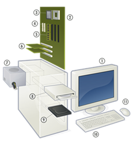

# Activité 1 - **Chapitre E.1 - Architectures matérielles**

## Exercice 1 - L'histoire de l'ordinateur
Associer chaque événement à la date qui lui correspond.
- Blaise Pascal invente la Pascaline. Cette machine est considérée comme la première machine à calculer.
- L'ENIAC est la premier ordinateur Turing-Complet. Cela signifie qu'il peut être, en théorie, programmé pour résoudre tous les problèmes de calculs numériques.
- Dans le cadre du projet EDVAC, John Von Neumann imagine un modèle d'ordinateur qui utilise une structure de de stockage unique pour le programme et les données du programme. Cette architecture porte aujourd'hui son nom.
- L'invention du transistor permet de diminuer drastiquement la taille des ordinateurs. En effet, il est beaucoup plus petit, plus léger et plus robuste que les tubes à vide utilisé jusqu'alors.

## Exercice 2 - Les composants d'un ordinateur
Sur l'image ci-dessous, donnez le nom de chaque élément et son rôle.

## Exercice 3 - Différents types de mémoire
Associer chaque type de mémoire à gauche du tableau à ces caractéristiques à droite :
|Mémoire|Caractéristiques|
|-|-|
|RAM|Mémoire qu'il n'est pas possible de modifier après son écriture.|
|ROM|Très petite mémoire directement intégré au processeur permettant de stocker des données temporaires pour les instructions en cours d'exécution.|
|Mémoire de masse|Mémoire de grande capacité permettant de stocker des documents à long terme.|
|Registre|Egalement appelée mémoire vive, mémoire permettant de stocker les données sur les programmes en cours d'exécution. Cette mémoire est volatile, cela signifie qu'une fois l'alimentation coupée, celle-ci est effacée.|

