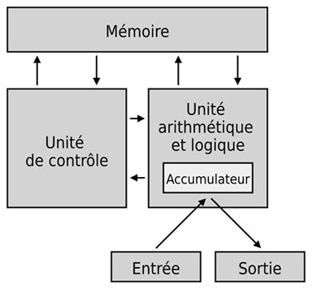
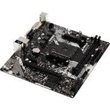
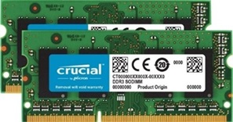
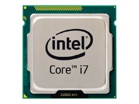

# Chapitre E.1 - Architectures matérielles
## I. Architecture Von Neumann
**John Von Neumann** (1903 - 1957) a participé à l'élaboration de l'EDVAC notamment en imaginant son architecture. Cette architecture est aujourd'hui appelé  architecture de Von Neumann.

L'architecture de Von Neumann découpe l'ordinateur en 4 parties :
- **L'UAL (Unité arithmétique et logique) :**  Le rôle de l'UAL est d'effectuer tous les calculs de base.
- **L'unité de contrôle :** Le rôle de l'unité de contrôle est de s'occuper du séquençage des opérations.
- **La mémoire :** La mémoire contient à la fois le programme (les instructions à exécuter) et les données du programme.
- **Les dispositifs d'entrée-sortie :** Son rôle est de permettre à la machine de communiquer avec le monde extérieur.

## II. Les composants d'un ordinateur
### A. La carte mère

La carte mère est le circuit imprimé qui supporte une grande partie des composants nécessaires au fonctionnement de l'ordinateur.

Elle regroupe les circuits principaux permettant l'acheminement des données (appelée bus) entre les composants ainsi que les circuits d'alimentation des composants.

### B. La mémoire
Il existe une multitude de mémoire dans un ordinateur :
- **La mémoire de masse** : Une mémoire de masse est une mémoire de grande capacité. Elle permet un stockage à long terme des données même en l'absence d'alimentation électrique .   
**Exemple :** Disque dur (HDD), Solid-state drive (SSD).  
 
- **La mémoire morte (ou ROM - Read Only Memory )** : Mémoire à long terme en lecture seule (qui ne peut pas être modifier).  
**Exemple :** CD-ROM, DVD, instruction du BIOS d'un ordinateur.
- **La mémoire vive (ou RAM - Random Access Memory )** : Mémoire rapide utilisé pour stocker les données des programmes qui sont en cours d'exécution dans l'ordinateur. La mémoire vive est **volatile**, cela signifie qu'elle est entièrement vidé lorsqu'elle n'est plus alimentée.  

- **Les registres du processeur** : Emplacement de mémoire interne au processeur. Il s'agit de la mémoire la plus rapide dans un ordinateur.

### C. Le processeur
  
Le processeur (ou CPU - central processing unit) est le composant principal de composant principal de l'ordinateur. C'est lui qui exècute toutes les instructions machines. Il est composé de l'**unité de contrôle**, l'**unité arithmétique et logique** et de **registres mémoires**.

Un processeur est rythmé par une horloge interne qui détermine la fréquence à laquelle le processeur exècute les instructions.  
**Exemple :** Le processeur Intel Core I7-9700 K peut atteindre une fréquence de 4,9 Ghz, c'est à dire qu'il est capable d'exècuter 4 milliard d'opérations par seconde.

#### Ordinateur multi-coeur / multiprocesseur
- Un processeur mutli-coeur est un processeur qui contient plusieurs unité de calculs.
- Un ordinateur multiprocesseur est un ordinateur contenant plusieurs processeurs distincts.

### D. Les périphértiques
Les périphériques sont des éléments connectés à l'ordinateur permettant d'ajouter des fonctionnalités.  
Les périphériques peuvent-être interne, c'est à dire directement connecté à la carte mère (**exemple :** carte graphique) ou externe, c'est à dire en dehors de l'ordinateur (**exemple :** clavier).

On divise les périphériques en plusieurs catégories :
- **Les périphériques d'entrée :** L'ordinateur reçoit des données du périphérique.
- **Les périphériques de sortie :** L'ordinateur envoie des données au périphérique.
- **Les périphériques d'entrée-sortie :** L'ordinateur peut recevoir des données du périphérique et en envoyer.