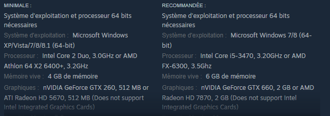

# Fiche d'exercices - **Chapitre E.1 - Architectures matérielles**

## Exercice 1
Que signifient les acronymes suivants ?
- CPU
- UAL
- RAM
- ROM

## Exercice 2
Associer les propriétés suivantes aux mots RAM et ROM :
- Mémoire vive volatile
- Read Only Memory
- Lecture/Ecriture des données
- Random Access Memory
- Lecture seule des données
- Mémoire morte permanente

## Exercice 3
Classer les périphériques suivants en fonction de leur nature (entrée, sortie ou entrée-sortie)
|  |  |  |  |
|--|--|--|--|
|Clavier|Souris|Lecteur/Graveur CD|Ecran|
|Haut-parleur|Photocopieur|TouchPad|Imprimante|
|Clef USB|Modem|Micro|Micro-casque|

## Exercice 4
Associer chaque définition dans la colonne de gauche au mot dans la colonne de droite :
|Définition|Mot|
|-|-|
|Circuit spécialisé comportant une petite quantité de mémoire ultra rapdie pour rendre les informations fréquemment de mandées immédiatement accessibles au processeur.|ROM|
|Petite mémoire contenu dans le microprocesseur destiné à stocker de manière très temporaire un certain nombre d'informations comme les résultats intermédiaires d'un calcul ou l'adresse de la prochaine instruction à exécuter.|Carte-Mère|
|Principale carte de circuits imprimés dans un ordinateur.|Microprocesseur|
|Ensemble de circuits imprimés dans un ordinateur|Mémoire cache|
|Ensemble de circuits gravés sur une plaque de silicium.|UAL|
|Mémoire dont le contenu peut-être lu mais non modifié|Circuit intégré|
|Ensemble de lignes transportant les signaux qui permettent au microprocesseur de communiquer avec ses mémoires et ses périphériques.|Python|
|Unité principale de traitement d'un ordinateur, généralement contenue dans un circuit intégré unique.|Registre|
|Type de mémoire volatile, lisible et réinscriptible, dont chaque cellule est directement accessible.|Transistor|
|Sorte de commutateur électroniques servant à controler le passage du courant électrique.|Transistor|
|Partie du microprocesseur qui exécutent les calculs arithmétique (addition, soustraction, ...) et les opérations logiques (et, ou, ...).|Bus|
|Langage de programmation|RAM|

## Exercice 5
Les indications suivantes indiquent les configurations nécessaires au lancement d'un jeu-vidéo :

Voici les carctéristiques de votre ordinateur :
|  |  |
|-|-|
|Système d'exploitation|WINDOWS 11 (64 bits)|
|RAM|4 Go|
|Processeur|Intel Core i7 3.1 Ghz|
|GPU|NVIDIA GTX 1050 Ti|
1. Pouvez-vous lancez le jeu vidéo ?
2. Disposez vous de la configuration recommandée ?
3. Les ordinateurs du lycée pourraient-ils faire tourner ce jeux-vidéo ?