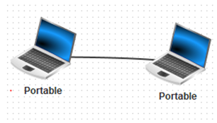
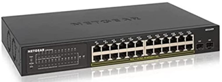
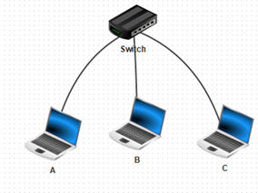
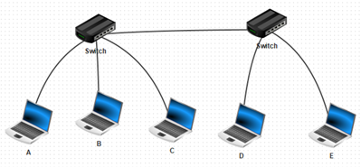
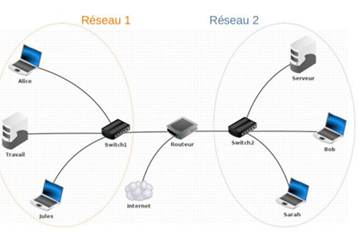
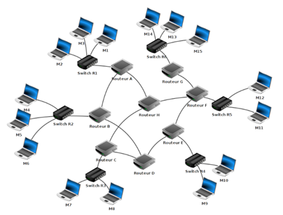

# Chapitre E.3 - Architecture d'un réseau

## I. Généralités sur les réseaux
### A. Définition 
Un réseau est un ensemble d’équipements informatiques (ordinateurs et matériels réseaux) reliés entre eux et capables d’échanger des informations. Ces équipements peuvent être reliés par des câbles (ethernet, fibre, ADSL …) ou par des technologies sans fil (WIFI, bluetooth).

### B. Portée d'un réseau
#### Réseaux locaux
Les réseaux PAN (Personnal Area network) désignent un micro-réseau local.
Exemple : Deux appareils reliés en bluetooth

Un réseau LAN (Local Area Network) désigne un réseau local géré par une personne ou un petit groupe de personnes.
Exemple : Réseaux d'un foyer, d'une entreprise d'un établissement scolaire

#### Réseau étendus
Un réseau étendu est un réseau constitué d’une multitude de sous-réseaux. 

Un réseau MAN (Metropolitan Area Network) désigne un réseau reliant les équipements au sein d’une zone plus étendue, à l’échelle d’une grande ville ou d’un groupement de plusieurs villes ou villages. 

Un réseau WAN (Wide Area Network) désigne un réseau permettant de connecter des machines sur de très grandes zones géographiques. On parle d’un réseau WAN pour un réseau d’envergure national voire mondial.

Internet est le plus grand réseau WAN.

## II. Architecture d'un réseau
### A. Le rôle du commutateur.

Le réseau le plus simple que l’on puisse mettre en place est constitué de deux machines reliées entre elles par un câble réseau. 

Cependant, lorsqu’un réseau contient une multitude de machines, il devient difficile de relier chaque machine à toutes les autres.

Pour résoudre ce problème, on utilise un commutateur (ou switch). Celui-ci permet de connecter un grand nombre d’ordinateurs au sein d’un réseau local. Il peut être considéré comme une multiprise ethernet intelligente. 

Exemple : Les ordinateurs A, B et C sont reliés entre eux via un switch, ils font donc partie d’un même réseau local.

Exemple : Les ordinateurs A, B et C sont reliés entre eux par un switch. 

Les ordinateurs D et E sont reliés entre eux par un autre switch. 

Les deux switchs sont reliés entre eux. Les ordinateurs A, B, C, D et E font donc partie d’un même réseau local.

### B. Le rôle du routeur.
pour que deux machines appartenant à deux réseaux locaux différents  puissent communiquer, on utilise un équipement permettant de créer une interface entre les deux réseaux appelé routeur. Celui-ci dispose d’au moins deux cartes réseaux et est capable de transmettre les informations d’un réseau à l’autre.

Le rôle de cet appareil est de transmettre les données de réseaux en réseaux pour atteindre le bon destinataire. C’est lui qui détermine le chemin à emprunter pour la transmission des données.

Un réseau étendu est constitué d’une multitude de réseaux locaux reliés entre par des routeur.

## III. Identifier les machines au sein d'un réseau
Pour identifier une machine au sein d’un réseau, on utilise de type d’adresse :

### A.	L’adresse MAC. (ou adresse physique)

Chaque carte réseau possède un numéro unique permettant de l’identifier. Ce numéro est propre à la carte réseau, il ne dépend pas du réseau auquel la machine est connectée.

Cette adresse est appelée adresse <spanc class="caché">MAC.

Cette adresse est constituée de 6 octets souvent représentée en hexadécimal.

Exemple : d5:2e:01:4b:58:6e

**Remarques :**
-	L'adresse physique est donnée par le constructeur, elle n'est pas modifiable
-	Une machine peut avoir plusieurs cartes réseau avec chacune une adresse physique différente. C'est le cas pour les routeurs.

### B.	L’adresse IP. (ou adresse logique)
L’adresse IP permet d’identifier une machine au sein d’un réseau. Cette adresse dépend du réseau auquel la machine est connectée. Elle est généralement attribuée lors de la connexion au réseau. 

Il existe plusieurs format d’adresse logique, la plus utilisé étant le format d’adresse IPV4
Dans cette version, celle-ci est constituée de 4 octets (4 nombres entiers compris entre 0 et 255) 

**Exemple :** 74.125.43.99

#### Adressage IP :
Il est possible de diviser une adresse réseau (adresse IP) en deux parties. La première partie d’une adresse réseau permet d’identifier le réseau et la seconde partie du réseau permet d’identifier la machine au sein du réseau local.

|Identifiant du réseau|Identifiant de la machine|
|-|-|
|159.65.|68.3|

Le **masque de sous-réseau** permet de savoir où faire la séparation entre l'identifiant réseau et l'identifiant de la machine.

Un masque de sous-réseau est formée de quatre octets. Dans un masque de sous-réseau, chacun des bits à 1 représente la partie réseau de l'adresse et chacun des bits à 0 représente l'identifiant de la machine.

> Exemple :
>
> Adresse IP : 159.65.62.3
>
> Masque de sous-réseau : 255.255.255.0
>
> |||
> |-|-|
> |Représentation binaire du masque de sous-réseau|11111111.11111111.11111111.00000000|
> |Représentation binaire de l'adresse IP|10011111.01000001.00111110.00000011|

Pour obtenir l'adresse IP du réseau, il faut remplacer tous les bits correspondant à l'identifiant de la machine par 0.

Pour obtenir l'adresse de diffusion (ou broadcast), il faut remplacer tous les bits correspondant à l'identifiant de la machine par 1.

> **Notation**
> 
>Parfois, le masque de sous-réseau est notifié comme-ci : 159.65.62.3/24
>
>Cette notation est appelée notation CIDR, cette notation correspond au nombre de bits à 1 dans le masque de sous-réseau.
>
>Dans notre exemple, le masque de sous réseau est constitué de 24 bits à 1, cela signifie que sa représentation binaire est donc : 1111 1111 . 1111 1111 . 1111 1111 . 0000 0000
>
> Sa représentation décimale est donc : 255.255.255.0

## IV. Le modèle d'échange TCP/IP
Le modèle TCP/IP est le modèle le plus utilisé aujourd'hui, il détermine l'ensemble des règle permettant l'échange de données au sein d'un réseau (local ou étendu).

### Les couches du modèle TCP/IP
||
|-|
|Application|
|Transport|
|Internet|
|Accès réseaux|

Lors d’un échange de données sur internet, une application (navigateur, serveur WEB, serveur de mail …) génère des données qui devront parvenir à destination via des protocoles adaptées (HTTP, FTP, SMTP, POP, etc...)

La couche Transport, grâce notamment au protocole TCP, à pour objectif de diviser les données en différents segments appelés paquets utilisable par la couche inférieur.

La couche Internet. permet, grâce au protocole IP, transforme les segments en paquets contenant les informations nécessaires à l’acheminement des données.

La couche Accès réseaux permet la circulation physique des informations. Il existe différents protocoles permettant de s’adapter aux supports de communications (WIFI, ADSL, Ethernet, etc...)
