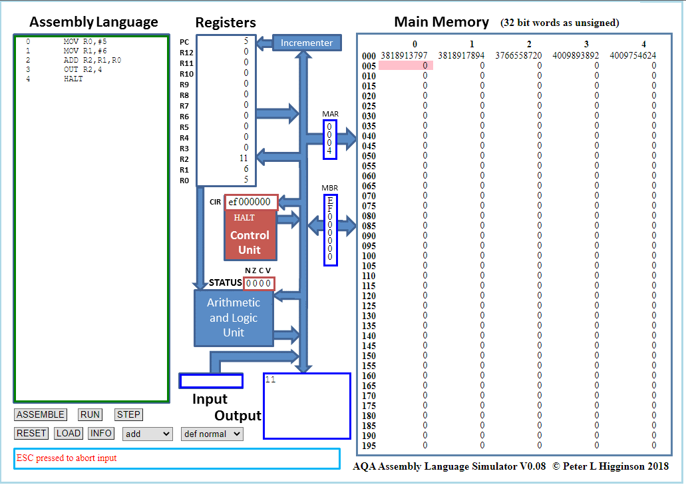

# TP - Le langage machine
## L'assembleur
Le processeur fonctionne avec des micro-instructions, chacune décrit une étape du cycle d’exécution du programme. Les micro-instructions peuvent être écrit en langage assembleur. L’assembleur est le langage de programmation le plus proche du fonctionnement réel du processeur. On appel cela un lange de bas niveau.

> Un langage de bas niveau est un langage qui est proche du fonctionnement du processeur. Au contraire, un langage de haut niveau est un langage qui s’éloigne du fonctionnement du processeur.
> 
> Un langage de haut niveau (comme Python) permet de réaliser un programme sans connaître la machine utilisée lors de l’exécution. Un programme écrit avec un langage de haut niveau est plus facile à écrire et est plus facilement portable d’une machine à une autre.

Pour ce TP, nous utiliserons un simulateur en ligne qui nous permet d’écrire du code en assembleur puis de visualiser comment se déroule l’exécution d’un programme au sein de l'ordinateur. 

[https://www.peterhiggson.co.uk/AQA](https://www.peterhigginson.co.uk/AQA/)



### Base de l'assembleur
> Pour exécuter un programme, il faut suivre les étapes suivantes : 
> - Ecrire le programme assembleur dans la zone **Assembly language**.
> - Cliquer sur **ASSEMBLE** pour charger le programme dans la mémoire.
> - Cliquer sur **RUN** pour exécuter le programme.
> -	Pendant l’exécution, il est possible de modifier la vitesse des animations à l’aide des flèches << et >>.

1. Exécuter le programme suivant :
```assembly
MOV R0,#10
MOV R1,#5
ADD R2,R1,R0
OUT R2,4
HALT
```

2. Que fait le programme ?
3. Donner les étapes du déroulement de l'exécution d'une instruction.

> L'instruction MOV permet de copier une valeur d'une registre à un autre. 
> - `MOV Cible, Depart`
>   - `R0` permet d'indiquer le registre 0
>   - `#10` permet d'indiquer la valeur 10 directement.

> L'instruction ADD permet de faire l'addition de deux registres et de stocker le résultat d'un troisième registre
> - `ADD RESULTAT, VALEUR1, VALEUR2`

> L'instruction OUT permet d'envoyer une valeur dans la sortie
> - `OUT registre, type`
>   - Le type de sortie dépend du type de donnée envoyée :
>       - 4 > Entier signé
>       - 5 > Entier non signé
>       - 6 > Hexadécimale
>       - 7 > Caractère

4. Ecrire un programme qui stocke les valeur 10, 20 et 30 respectivement dans les registre 1, 2 et 3. Fais l'addition de ces trois valeur est renvoie le résultat.

### Principales instructions
Voici quelques instructions présentes sur le simulateur :
- `LDR Rd, adresse mémoire`
    - Charge la valeur de l'adresse dans le registre Rd. 
- `STR Rd, adresse mémoire`
    - Place le contenu du registre Rd à l'adresse mémoire
- `ADD Rd, Rn, opérande`
    - Additionne opérande et Rn et place le résultat dans Rd. Opérande peut être un nombre (précédé de dièse) ou la valeur d'un registre Rm
-   `SUB Rd, Rn, opérande :` 
    - Soustrait opérande et Rn et place le résultat dans Rd. Opérande peut être un nombre (précédé de dièse) ou la valeur d'un registre Rm
- `MOV Rd, opérande`
    Copie la valeur d’opérande dans Rd
- `HALT`
    - Arrêt du programme
- `INP Rd, type`
    - Attend un nombre en entrée
- `OUT Rd, type`
    - Affiche la valeur de Rd à l'écran.

5. Testez et déterminez ce que fait le programme suivant :
```assembly
INP R0,2
INP R1,2
ADD R2,R1,R0
OUT R2,4
HALT
```

6. Compléter le programme suivant pour qu’il enregistre dans la mémoire (à l’emplacement de votre choix) le résultat de la soustraction de deux nombres demandés à l’utilisateur.
```assembly
INP R0,2
INP R1,2
… R2,R0,R1
… R2,…
HALT
```
### Conditions et boucles
L’instruction CMP permet de comparer deux valeurs, le résultat de la comparaison est conservé dans la case mémoire STATUS de l’unité arithmétique et logique. 

Ce résultat peut être réutilisé dans l’instruction suivante, pour cela, on utilise les instructions BEQ (est égal), BNE (pas égal), BGT (plus grand que) et BLT (plus petit que).

L’instruction fonctionne avec ce qu’on appelle des étiquettes, si la condition est vraie, on saute à l’étiquette nommée, sinon on passe à l’instruction suivante.

L’instruction B suivie d’une étiquette permet de passer à une étiquette sans vérifier de condition.

** Exemple :**
```assembly
      INP R0,2  		/On demande une valeur à l'utilisateur puis on la stocke dans R0
      CMP R0,#0  		/On compare R0 et 0
      BGT plus_grand 	/Si R0 est plus grand que 0 on passe à l’étiquette "plus_grand"
      MOV R1,#1  		/On affecte la valeur 1 à R1
      OUT R1,4  		/On affiche la valeur de R1
      HALT  		    /On arrête le programme
plus_grand:  		    /Etiquette "plus_grand"
      MOV R1,#2  		/On affecte la valeur 2 à R1
      OUT R1,4 		    /On affiche la valeur de R1
      HALT  		    /On arrête le programme
```

7. Compléter le programme suivant pour qu'il affiche 1 si la valeur demandée à l'utilisateur est comprise entre 0 et 20, et 0 sinon.

```assembly
    INP R0,2
    CMP R0,#0
    … incorrect
    CMP ……
    … incorrect
    MOV R1,#1
    OUT R1,4
    HALT
incorrect:
    MOV R1,#0
    OUT R1,4
    HALT
```

8. A l’aide des instructions de saut et de comparaison, écrire un programme qui affiche tous les entiers positifs plus petits que 10. 

(Ici, l’objectif est de chercher comment on peut écrire une boucle à l’aide du langage assembleur).