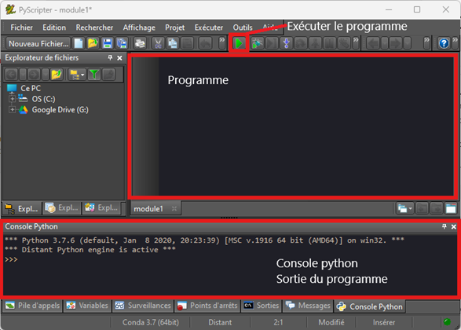

#  **Chapitre F.1 - Construction de programme**
## I. Introduction
> "**Un programme** informatique est un ensemble d'instructions et d'opérations destinés à être exécutées par un ordinateur."  
> *Source : Wikipedia*
>
> Pour écrire un programme, on utilise un langage particulier appelé **langage de programmation**.
> 
> En Numérique et Sciences Informatiques, nous utiliserons le langage **Python**.
>
>> **Python** est un langage de programmation crée en **1989** par **Guido Van Rossum**.

## II. L'environnement de développement
### A. Définition
> Pour lancer un programme python, il faut écrire le code du programme dans un fichier python (**.py**) puis lancer l'interpréteur Python. Il est fastidieux d'écrire et d'exécuter son code à partir de deux logiciels différents, puisqu'il faut jongler entre les deux logiciels en permanence.

> Un **environnement de développement** est un logiciel permettant d'écrire du code et de l'exécuter dans un seul et même programme. De plus, il est généralement accompagné d'outils permettant de faciliter l'écriture du code et la correction d'erreurs.

### B. Edupython
> En NSI, nous utiliserons l'environnement de développement EDUPYTHON.
>
> 

## III. Les bases de la programmation
### A. Les opérateur python
**Exercice 1**

Dans la console, tester les instructions et compléter le tableau suivant :
|Instruction|Résultat obtenu|Opération réalisée|
|-|-|-|
|```30 + 3```||
|```8 - 7```||
|```5 * 6```||
|```16 / 3```||
|```16 // 3```||
|```16 % 3```||
|```'He'+"llo"```||

**Exercice 2**

En vous aidant de l'exercice précédent et de la console python, compléter le tableau suivant en indiquant ce que permet chacun des opérateur suivant :
|Opérateur|Opération|
|-|-|
|```+```||
|```-```||
|```*```||
|```/```||
|```//```||
|```%```|Modulo (reste de la division entière)|
|```**```||
|```+```||
|```<```||
|```<=```||
|```==```||
|```>=```||
|```>```||

### B. Les types de données
**Exercice 3**

1. Dans la console, taper l'instruction suivante
```python
type(0)
```
- ```type``` est une fonction déterminer ce qu'elle permet d'obtenir.

..............................................................................................................................................................................
- Quel type de données en python permet donc de représenter un entier ?
..............................................................................................................................................................................
2. Dans la console, utiliser la fonction ```type``` pour compléter le tableau suivant :

|valeur|Type python|Type de valeur représentée|
|-|-|-|
|```5```|||
|```5.3```|||
|```1.0```|||
|```True```|||
|```"Bonjour```|||

**Exercice 4**

Dans la console python, tester les instructions et compléter le tableau suivant :
|Instruction|Résultat obtenu|Type du résultat|
|-|-|-|
|```9 + 5```|||
|```10 - 5```|||
|```12 * 15```|||
|```12 / 6```|||
|```65 % 4```|||
|```12.5 / 5.5```|||
|```4 < 5```|||
|```2 * 0.5```|||
|```10 // 2```|||
|```5 - 4.32```|||
|```25 <= 21```|||


**Exercice 5**
Sans l'aide de python, determiner le type de chacune des opérations suivantes : 
|Instruction|Type du résultat|
|-|-|
|```1 + 1```||
|```1.0 + 1```||
|```3 == 4```||
|```‘Bonjour’ + ‘Monsieur’```||
|```1.0 – 1```||
|```1 * 5```||
|```1.0 * 5```||
|```5 – 5```||
|```5 ** 5```||
|```10 / 2```||
|```10 // 2```||
|```10 % 2```||

**Exercice 6**

Sans l'aide de python, pour chacune des expressions suivantes, donner le résultat obtenu et son type.
|Instruction|Résultat|Type|
|-|-|-|
|```5 + 5.0``` |||
|```1 + 3``` |||
|```"Bonjour" + " le monde"```|||
|```int("4" + "5")```|||
|```"Le résultat est " + float(4 +int("5" + "0")) + "."```|||
|```5 < 4```|||
|```4 < 5```|||

> Il est parfois nécessaire de changer le type d'une expression. Pour changer le type d'une expressions on utilise les fonction suivantes :
> - La fonction ```str``` permet de changer le type de la valeur en str.
> - La fonction ```int``` permet de chagner le type de la valeur en int.
> - La fonction ```float```permet de changer le type de la valeur en float.
>
> **Exemple :**
> ```python
> >>> int("55")
> 55
> ```
> 
> Lorsque la conversion n'est pas possible, le programme déclenche une erreur et s'arrête.

### C. Les variables
> Une **variable** est un élément qui associe un nom à une valeur. Une variable contient une valeur qui peut-être modifié au cours de l'exécution du programme.
> 1. Le **nom** de la variable : c'est ce qui permet de reconnaître la variable. Il nous permet de ne pas retenir l'adresse mémoire dans laquelle est stockée la valeur.
> > Le nom d'une variable doit être uniquement composé par :
> > - Des lettres (minuscule ou majuscule).
> > - Des chiffres (⚠ Le nom d'une variable ne peut pas commencé par un chiffre.).
> > - Le caractère undescore (**_**).
> 2. La **valeur** : c'est la donnée stockée.

**Exercice 7**
Sans l'aide de python, determiner la valeur de la variable ```c``` à la fin de l'exécution du programme :
1. 
```python
a = 7
b = 10
c = a + b
```

2. 
```python
a = 0
a = a + 1
a = a + 2
c = a
```

3. 
```python
a = 4
b = 5
a = a + b
c = a + a
c = c + 5
```

4. 
```python
a1 = 1
a2 = 2
a3 = 3
somme = a1 + a2 + a3
c = "Le resultat est " + str(somme) + "."
```
**Exercice 8**
Analyser et tester les programmes suivants, que font-il ?

1. 
```python
a = int(input("Valeur 1"))
b = int(input("Valeur 2"))
c = a + b
print(c)
```

2. 
```python
valeur_1 = int(input("Quelle est la première valeur ?"))
valeur_2 = int(input("Quelle est la seconde valeur ?"))
plus_grand = valeur_1 > valeur_2
print(plus_grand)
```
### D.Interaction avec l'utilisateur
> Pour afficher des informations dans la console, on utilise la fonction ```print```.
>**Exemple 1 :**
>```python
>print("Hello World !")
>```
>
>**Exemple 2 :**
>```python
>nom = "Wotte"
>prenom = "Ca"
>print("Vous vous appelez ", nom, " ", prenom)
>```

>Pour demander une valeur à l'utilisateur, on utilise la fonction ```input```.
>
>**Exemple :**
>```python
>age = input("Quelle est votre age ?")
>print("Vous avez ", age, "ans")
>```
>
>⚠ Le type de donnée obtenu par ```input``` est ```str```. Pour pouvoir faire un traitement des données il faudra parfois modifier le type de la donnée.
>
>**Exemple :**
>```python
>valeur = int(input("Quelle nombre multiplier par 10 ?"))
>resultat = valeur * 10
>print(resultat)
>```

**Exercice 9**

Le programme suivant permet à l'utilisateur de connaître son age à partir de son année de naissance et de l'année actuelle. Compléter et tester le programme :
```python 
annee_actuelle = int(input("En quelle année sommes nous ?"))
annee_naissance = ...
age = ...
print("votre age est :", age)
```

**Exercice 10**

Ecrire un programme qui demande la longueur et la largeur d'un rectangle et qui renvoie l'aire de celui-ci.
>**Rappel :**
>
>$aire = longueur \times largeur$

Tester votre programme.

**Exercice 11**

On considère le programme suivant : 
```python
a = 0
b = a + 1
c = a + 2
print(a < c and c > b)
```

1. Qu'afiche le programme ?
2. A quoi sert l'opérateur ```and``` ?

On considère le programme suivant : 
```python
a = 0
b = a + 1
c = a + 2
print(a > c or c > b)
```
1. Qu'affiche le programme ?
2. A quoi sert l'opérateur ```or``` ?