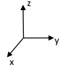

# DM 6 - Sur feuille
## Exercice 1

L’objectif de cet exercice est de réaliser un jeu vidéo. Il s’agit d’un jeu de plateau sur le thème des chevaliers de la table ronde dans lequel plusieurs personnages doivent réaliser des missions.

Ces personnages doivent récupérer des objets sur leur parcours. La récupération de ces objets leur permettra de gagner des points de vie ou d’en perdre.

### PARTIE 1

On s’intéresse ici au déplacement des personnages. L’espace dans lequel ils évoluent est représenté par un repère orthonormé à trois axes. La position de chaque personnage sera repérée par ses attributs x, y, z.


 
1.	 
a.	Recopier sur la copie et compléter le constructeur de la classe Personnage positionnant un personnage aux coordonnées choisies x, y et z.
```python
class Personnage:
    def __init__(self, coordx, coordy, coordz): 
        ...
        ...
        ...
```

b.	Écrire un méthode ```avancex``` de la classe Personnage permettant d’augmenter d’une unité la coordonnée x du personnage.

c.	Écrire une méthode ```raz``` permettant de mettre les coordonnées d’un personnage à zéro.

d.	Écrire une méthode ```coord``` qui renvoie les coordonnées d’un personnage sous forme d’un tuple.


2.	En utilisant les méthodes écrites dans la partie 1, écrire des lignes de code permettant :

a.	De créer un personnage arthur démarrant à la position (5,5,5) ;

b.	D’augmenter d’une unité la coordonnée x du personnage arthur ;

c.	D’afficher les coordonnées du personnage arthur.


### PARTIE 2

Chaque personnage du jeu va rencontrer différentes situations (potions, pièges, …) qui vont faire évoluer ses points de vie. La classe Personnage est modifiée afin de permettre ces évolutions.
```python
class Personnage :
    def __init__(self, coordx, coordy, coordz, point_de_vie):
        ... # défini dans la partie 1
        self.vie = point_de_vie

    def avancex ... # défini dans la partie 1
    def raz ... # défini dans la partie 1
    def coord ... # défini dans la partie 1

    def get_etat(self) :
        return self.vie
    
    def newgame(self) :
        ………………… # défini dans la partie 2

    def potionmystere(self) :
        if random.randint(1,2) == 1 :
            nbPoint = -1
        else :
            nbPoint = +1
        self.vie = self.vie + nbPoint

    def piege(self) :
        self.vie = self.vie – 10

    def repos(self) :
        self.vie = self.vie + 5
```

1.	Indiquer les valeurs possibles de la nouvelle variable valeurMerlin après exécution du programme ci-dessous :
```python
merlin = Personnage(4, 5, 8, 15)
merlin.potionmystere()
valeurMerlin = merlin.get_etat()
```


2.	Indiquer la valeur de la nouvelle variable valeurMerlin après exécution du programme ci-dessous.
```
merlin = Personnage(4, 5, 8, 20)
merlin.piege()
merlin.piege()
valeurMerlin = merlin.get_etat()
```


3.	Ecrire sur la copie, la méthode ```newgame``` permettant, si le nombre de point de vie est inférieur ou égal à 0, de :
-	Ramener les coordonnées du personnage à (0, 0, 0)
-	Lui attribuer 15 points de vie.

## Exercice 2
Un cuisinier fait des crêpes et les pose en pile à coté de la poêle lorsqu’elles sont cuites. On dispose donc d’une pile de crêpes, chacune de taille différente.

Le cuisinier souhaite trier la pile de façon à ce que la crêpe de plus grand diamètre se situe au fond de la pile et la crêpe de plus petit diamètre se situe au sommet de la pile.

Pour trier ses crêpes, la seul chose que le cuisinier peut faire et de prendre une spatule, de l’insérer à un endroit dans la pile et de retourner d’un coup toutes les crêpes au dessus.


Exemple : Le cuisinier insère sa spatule dans la pile de crêpes et retourne toutes les crêpes du dessus de la pile

Principe de l’algorithme permettant de trier les crêpes :
-	On recherche la plus grande crêpe
-	On retourne la pile juste en plaçant la spatule juste en dessous de cet crêpe de façon à ce que la plus grande crêpe soit au sommet de la pile.
-	On retourne maintenant toute la pile de façon à ce que la plus grande crêpe se trouve au fond de la pile.
-	La plus grande crêpe étant maintenant bien placé, on recommence en ne prenant plus en compte les crêpes bien placées.

On modélise la pile de crêpes par une Pile contenant des entiers représentant le diamètre des crêpes.

Ci-dessous-vous on retrouve l’interface de la structure de données Pile qu’on utilisera dans cet exercice :
-	creer_pile_vide : ∅ → Pile  
creer_pile_vide() renvoie une pile vide
-	est_vide : Pile → Booléen  
est_vide(pile) renvoie True si pile est vide, False sinon
-	empiler : Pile, Élément → Rien  
empiler(pile, element) ajoute element au sommet de la pile
-	depiler : Pile → Élément  
depiler(pile) renvoie l’élément au sommet de la pile en le retirant de la pile

1.	On suppose pour cette question que le contenu de la pile P est le suivant :

||
|-|
|6|
|4|
|10|
|9|

a.	Quel est le résultat de l’instruction suivante ?
```python
depiler(P)
```

b.	Que sera le contenu de la pile Q après l’exécution du programme suivant ?
```python
Q = creer_pile_vide()
while not est_vide(P):
    v = depiler(P)
    if v % 2 == 0:
        empiler(Q,v)
```

2.	Écrire une fonction hauteur_pile qui prend une pile P en paramètre et qui renvoie le nombre d’éléments contenus dans la pile.   
Attention, à la fin de l’exécution de votre fonction, la pile P doit retrouver son état d’origine.

3.	Ecrire une fonction max_pile qui prend deux paramètres : une pile P et un entier i.  
La pile renvoie le nombre correspondant à la place de la plus grande valeur dans la pile entre le sommet et la i-ème valeur de la pile. Le sommet de la pile correspond à la première valeur.  
Attention, à la fin de l’exécution de votre fonction, la pile P doit retrouver sont état d’origine.


Exemple : 
On considère la pile p suivante : 

||
|-|
|6|
|3|
|7|
|2|
|10|

```max_pile(p,4)``` renvoie 3 car la plus grande valeur de la pile est 7 et correspond à la troisième valeur de la pile

4.	Compléter la fonction retourner qui prend une pile P et une position j en paramètre et qui inverse les j premiers éléments de la pile.
Exemple :
On considère la pile p suivante :

||
|-|
|6|
|3|
|7|
|2|
|10|

Après l’instruction : retourner(p,3) la pile p sera : 

||
|-|
|7|
|3|
|6|
|2|
|10|

Pour renverser les j premiers éléments de la pile, on les dépile dans une première pile, puis on inverse cette pile dans une seconde pile, enfin on les replace dans la pile p .

```python
def retourner(p, j):
    pile1 = ………
    for i in range(j):
        empiler(pile1, depiler(………))
    
    pile2 = ………
    while not est_vide(pile1):
        empiler(………, depiler(………))

    while ………:
        empiler(………)
```

5.	En utilisant les fonctions des précédents exercices, écrire la fonction tri_crepes qui prend une pile p en paramètre et qui trie la pile de façon à ce que la plus petite valeur soit au sommet de la pile.

## Exercice 3
1.	Donner les différentes couches du modèle TCP-IP

2.	Expliquer la différence entre l’adresse MAC et l’adresse IP.

3.	On prend l’adresse IP suivante : 90.24.29.12 et son masque de sous-réseau : 255.255.224.0

a.	Quelle est l’adresse IP du réseau auquel appartient l’adresse IP ?

b.	Quelle est la première adresse du réseau qu’il est possible de donner à une machine ?

c.	Quelle est la dernière adresse du réseau qu’il est possible de donner à une machine ?

4.	Les machines 108.123.4.5/24 et 108.123.5.5/24 appartiennent-elles au même réseau ? Justifier.
