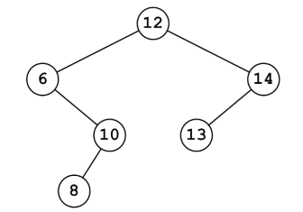

# Devoir - Arbres binaires

Dans un entrepôt de e-commerce, un robot mobile autonome exécute successivement les tâches qu’il reçoit tout au long de la journée.

La mémorisation et la gestion de ces tâches sont assurées par une structure de données.

1. Dans l'hypothèse où les tâches devraient être extraites de cette structure (pour être exécutées) dans le même ordre qu’elles ont été mémorisées, préciser si ce fonctionnement traduit le comportement d’une file ou d’une pile. Justifier.

En réalité, selon l'urgence des tâches à effectuer, on associe à chacune d’elles, lors de la mémorisation, un indice de priorité (nombre entier) distinct : il n'y a pas de valeur en double.

**Plus cet indice est faible, plus la tâche doit être traitée prioritairement.**

La structure de données retenue est assimilée à un arbre binaire de recherche (ABR) dans lequel chaque nœud correspond à une tâche caractérisée par son indice de priorité.

> **Rappel :** Dans un arbre binaire de recherche, chaque nœud est caractérisé par une valeur (ici l'indice de priorité), telle que chaque nœud du sous-arbre gauche a une valeur strictement inférieure à celle du nœud considéré, et que chaque nœud du sous-arbre droit possède une valeur strictement supérieure à celle-ci.
>
> Cette structure de données présente l'avantage de mettre efficacement en œuvre l'insertion ou la suppression de nœuds, ainsi que la recherche d'une valeur

Par exemple, le robot a reçu successivement, dans l’ordre, des tâches d’indice de priorité 12, 6, 10, 14, 8 et 13. En partant d’un arbre binaire de recherche vide, l’insertion des différentes priorités dans cet arbre donne la figure 1.


> Figure 1 : Exemple d'un arbre binaire

2. En utilisant le vocabulaire couramment utilisé pour les arbres, préciser le terme qui correspond :
- (a) au nombre de tâches restant à effectuer, c’est-à-dire le nombre total de nœuds de l’arbre ;
- (b) au nœud représentant la tâche restant à effectuer la plus ancienne ;
- (c) au nœud représentant la dernière tâche mémorisée (la plus récente).

3. Lorsque le robot reçoit une nouvelle tâche, on déclare un nouvel objet, instance de la classe `Noeud`, puis on l’insère dans l’arbre binaire de recherche (instance de la classe `ABR`) du robot. Ces 2 classes sont définies comme suit :

```python

class Noeud:
    def __init__(self, tache, indice):
        self.tache = tache #ce que doit accomplir le robot
        self.indice = indice #indice de priorité (int)
        self.gauche = ABR() #sous-arbre gauche vide (ABR)
        self.droite = ABR() #sous-arbre droit vide (ABR)
class ABR:
    #arbre binaire de recherche initialement vide
    def __init__(self):
        self.racine = None #arbre vide
        #Remarque : si l'arbre n'est pas vide, racine est
        #une instance de la classe Noeud
    def est_vide(self):
        """renvoie True si l'arbre autoréférencé est vide,
        False sinon"""
        return self.racine == None
    def insere(self, nouveau_noeud):
        """insere un nouveau noeud, instance de la classe
        Noeud, dans l’ABR"""
        if self.est_vide():
            self.racine = nouveau_noeud
        elif self.racine.indice …… nouveau_noeud.indice
            self.racine.gauche.insere(nouveau_noeud)
        else:
            self.racine.droite.insere(nouveau_noeud)
```

- (a) Donner le nom des attributs de la classe `noeud`.
- (b) Expliquer en quoi la méthode insere est dite récursive et justifier rapidement qu’elle se termine.
- (c) . Indiquer le symbole de comparaison manquant dans le test à la ligne 26 de la méthode insere pour que l’arbre binaire de recherche réponde bien à la définition de l’encadré « Rappel ».
- (d) On considère le robot dont la liste des tâches est représentée par l’arbre de la figure 1. Ce robot reçoit, successivement et dans l’ordre, des tâches d’indice de
priorité 11, 5, 16 et 7, sans avoir accompli la moindre tâche entre temps. Recopier et compléter la figure 1 après l’insertion de ces nouvelles tâches.

4. Avant d’insérer une nouvelle tâche dans l’arbre binaire de recherche, il faut s’assurer que son indice de priorité n’est pas déjà présent.  
Écrire une méthode `est_present` de la classe ABR qui répond à la description :   
```python
def est_present(self, indice_recherche):
    """
    renvoie True si l’indice de priorité indice_recherche (int) passé en paramètre est déjà l’indice d’un nœud de l’arbre, False sinon
    """
```
5. Comme le robot doit toujours traiter la tâche dont l’indice de priorité est le plus petit, on envisage un parcours infixe de l’arbre binaire de recherche.

- (a) Donner l’ordre des indices de priorité obtenus à l’aide d’un parcours infixe de l’arbre binaire de recherche de la figure 1.
- (b) Expliquer comment exploiter ce parcours pour déterminer la tâche prioritaire.

6.  Afin de ne pas parcourir tout l'arbre, il est plus efficace de rechercher la tâche du nœud situé le plus à gauche de l'arbre binaire de recherche : il correspond à la tâche prioritaire.
    Recopier et compléter la méthode récursive `tache_prioritaire` de la classe `ABR`: 

```python
def tache_prioritaire(self):
    """renvoie la tache du noeud situé le plus
    à gauche de l'ABR supposé non vide"""
    if self.racine.……….est_vide():#pas de nœud plus à gauche
        return self.racine.………
    else:
        return self.racine.gauche.………()
```

7. Une fois la tâche prioritaire effectuée, il est nécessaire de supprimer le nœud correspondant pour que le robot passe à la tâche suivante : 
- Si le nœud correspondant à la tâche prioritaire est une feuille, alors il est simplement supprimé de l'arbre (cette feuille devient un arbre vide)
- Si le nœud correspondant à la tâche prioritaire a un sous-arbre droit non vide, alors ce sous-arbre droit remplace le nœud prioritaire qui est alors écrasé, même s'il s'agit de la racine.

    Dessiner alors, pour chaque étape, l'arbre binaire de recherche (seuls les indices de priorités seront représentés) obtenu pour un robot, initialement sans tâche, et qui a, successivement dans l'ordre :
    - étape 1 : reçu une tâche d'indice de priorité 14 à accomplir
    - étape 2 : reçu une tâche d'indice de priorité 11 à accomplir
    - étape 3 : reçu une tâche d'indice de priorité 8 à accomplir
    - étape 4 : accompli sa tâche prioritaire
    - étape 5 : reçu une tâche d'indice de priorité 12 à accomplir
    - étape 6 : accompli sa tâche prioritaire
    - étape 7 : accompli sa tâche prioritaire
    - étape 8 : reçu une tâche d'indice de priorité 15 à accomplir
    - étape 9 : reçu une tâche d'indice de priorité 19 à accomplir
    - étape 10 : accompli sa tâche prioritaire