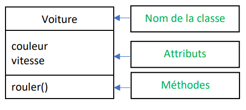
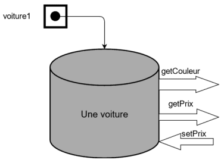
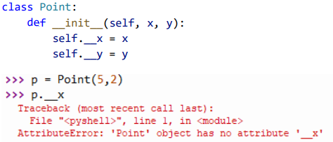

# Chapitre A.2 : Les bases de la programmation orientée objets

## I. Le programmation orientée objet, c'est quoi ?
Jusqu’à présent, le paradigme (famille) de programmation que nous avons utilisé est la programmation procédurale. Celui-ci repose sur l’utilisation de fonctions et de procédures permettant de décomposer un problème complexe en sous-problème plus simple à résoudre.

Il existe un paradigme de programmation plus intuitif et plus proche de notre raisonnement. Il s’agit de la programmation orientée objet. La programmation orientée objet repose sur des briques logicielles appelés objets. Un objet permet de représenter un concept, une idée ou tout autre entité du monde réel (une voiture, une personne, une salle de classe etc…).

Un objet se caractérise par 3 éléments : 
- <span class="caché">Son état (valeurs des attributs de l'objet à un instant)</span>
- <span class="caché">Son comportement (méthodes qui définissent ce que l'on peut faire avec l'objet)</span>
- <span class="caché">Son identité (nom définit lors de la création de l'objet)</span>

## II. Notion de class 
Pour s'imaginer ce que représente la classe par rapport à la programmation orientée objets, on peut imaginer que la classe correspond à "l'usine" permettant de fabriquer le objets. Chaque objet possède des caractéristiques (<span class="caché">**attributs**</span>) et des actions exécutables (<span class="caché">**méthodes**</span>.

**Exemple :**  
 

La classe voiture ci-dessus regroupe un ensemble de caractéristiques communes à toutes les voitures d’un jeu vidéo.

Les attributs d’une classe correspondent <span class="caché">à des propriétés que possèdent les objets de la classe</span>. Par exemple, chaque voiture possède une couleur et une vitesse.

Les méthodes d’une classe correspondent <span class="caché">aux actions des objets</span>. Par exemple, chaque voiture est capable de rouler.

Pour définir une classe, on utilise le mot clé class suivi du nom de notre nouvelle classe.

```python
class Voiture:
    '''Définition d'une voiture'''
```

> ⚠ Par convention, le nom d’une classe commence **toujours <span class="caché">par une lettre majuscule</span>**.

## III. Notion d'objet
Si la classe correspond à l’usine permettant de fabriquer des objets, un objet correspond <span class="caché">à une **instance de la classe**</span>. C’est-à-dire qu’elle correspond à un élément du type de la classe. 

Par exemple, il n’existe qu’une seule classe Voiture mais il peut exister une multitude d’instances de Voiture. Cela signifie qu’il peut y avoir plusieurs voitures avec chacune des couleurs et des vitesses différentes. Chacune d’entre elle est un <span class="caché">**objet**</span> de la classe Voiture (ou <span class="caché">**une instance**</span> de la classe Voiture).

```python
yaris = Voiture()

print(yaris)

<__main__.Voiture object at 0x000001FE7BBC4880>
```

> Python indique qu’il s’agit d’une référence à une instance de la classe Voiture. L’adresse de la référence est située à l’emplacement indiqué en hexadécimale dans la mémoire vive.

## IV. Les attributs
Les attributs correspondent aux différentes caractéristiques de notre objet. Ces caractéristiques sont les mêmes pour l’ensemble des objets d’une classe mais leurs valeurs peuvent être différentes pour chacune d’entre elle.

Dans une grande partie des langages de programmation, les attributs doivent être déclaré dans la définition de la classe. En Python, ils sont déclarés directement au sein du code.

Pour créer, modifier ou accéder à un attribut, on utilise la variable qui contient la référence à l’objet suivi d’un point et du nom de l’attribut.

```python
class Rectangle:
    '''Définition d'un rectangle'''

r1 = Rectangle()
r1.largeur = 1
r1.longueur = 2

print("r1 : largeur =", r1.largeur, "longueur =", r1.longueur)
r1 : largeur = 1 longueur = 2
```

## V. Les méthodes
Les méthodes d’une classe correspondent aux actions qu’il est possible d’exécuter sur nos objets.

Pour définir une méthode, il faut indiquer son nom précédé du mot ```def```, indiquer les paramètres entres les parenthèses. 

Le premier argument d’une méthode doit toujours être self. **Celui-ci correspond à l’objet lui-même**.

**Exemple :**
Les méthodes ```__init__```, ```affiche```, ```aire```, ```perimetre``` et ```est_carre``` de la classe Rectangle.

```python
class Rectangle:
    '''Définition d'un rectangle'''
    def __init__(self, longueur, largeur):
        '''Constructeur'''
        self.longueur = longueur
        self.largeur = largeur
    def affiche(self) :
        '''Affiche les caractéristiques du rectangle'''
        print("Largeur : ", self.largeur, " Longueur : ", self.longueur)
    def aire(self):
        '''Renvoie l'aire du rectangle'''
        return self.largeur * self.longueur
    def perimetre(self):
        '''Renvoie le périmètre du rectangle'''
        return self.largeur * 2 + self.longueur * 2
    def est_carre(self):
        '''Renvoie True si le rectangle est un carre'''
        return self.largeur == self.longueur
```
> La méthode __init__ est une méthode particulière, il s’agit du  <span class="caché">**constructeur**</span> de la classe. Il s’agit de la méthode qui est appelé <span class="caché">lors de la création d’un objet</span>, elle permet notamment de **définir les attributs de l’objet**. Le constructeur de la classe peut ou non contenir des arguments en entré. Le constructeur d’une classe ne doit pas renvoyer de valeur. 
>
> Il existe d’autres méthodes particulières en Python, celles-ci commencent et finissent toujours par deux underscores.
> **Exemple :** ```__repr__``` et ```__str__```.

## VI. Concept d'encapsulation
Pour respecter les principes de la programmation orientée objets, il est important d’imaginer les objets comme des boites avec lesquels on ne peut interagir qu’en utilisant les méthodes de la classe.

En respectant ce principe, il est impossible de modifier une valeur sans échapper aux contrôles prévus par le développeur de la classe et ainsi éviter tout risques d’erreur liés à la modification d’un attribut qui ne devait pas l’être.

Pour être certain que l’utilisateur de la classe respecte ce principe, il faut lui interdire l’accès aux attributs en dehors des méthodes de la classe. Pour ce faire, il faut rendre les attributs privés. Ainsi, l’utilisateur de la classe n’y aura pas accès.

En python, pour rendre un attribut privé, on ajoute deux underscores (_) devant le nom de l’attribut.

Il devient alors impossible d’accéder à notre attribut en dehors de la classe. Il devient en revanche nécessaire de créer des méthodes pour permettre à l’utilisateur de modifier les attributs de la classe

Ces méthodes sont les accesseurs (permettent de lire la valeur des attributs) et les mutateurs (permettent de modifier la valeur des attributs) 

Généralement le nom des accesseurs est de la forme suivante : ```get_NomDeLAttribut```

Généralement le nom des mutateurs est de la forme suivante : ```set_NomDeLAttribut```