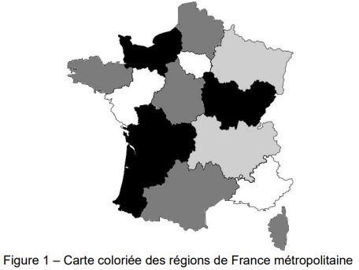

# Fiche d'exercices - **Chapitre A.2 - La programmation orientée objets**

Un pays est composé de différentes régions. Deux régions sont voisines si elles ont au moins une frontière en commun. L'objectif est d'attribuer une couleur à chaque région sur la carte du pays sans que deux régions voisines aient la même couleur et en utilisant le moins de couleurs possibles. 

La figure 1 ci-dessous donne un exemple de résultat de coloration des régions de la France métropolitaine. 



On rappelle quelques fonctions et méthodes des tableaux (le type list en Python) qui pourront être utilisées dans cet exercice :
- ```len(tab)``` : renvoie le nombre d'éléments du tableau tab ;
- ```tab.append(elt)``` : ajoute l'élément elt en fin de tableau tab ;
- ```tab.remove(elt)``` : enlève la première occurrence de elt de tab si elt est dans ```tab```. Provoque une erreur sinon.

Exemple :
- ```len([1, 3, 12, 24, 3])``` renvoie ```5``` ;
- avec ```tab = [1, 3, 12, 24, 3]```, l’instruction ```tab.append(7)``` modifie ```tab``` en ```[1, 3, 12, 24, 3, 7]``` ;
- avec ```tab = [1, 3, 12, 24, 3]```, l’instruction ```tab.remove(3)``` modifie ```tab``` en ```[1, 12, 24, 3]```. 

Les deux parties de cet exercice forment un ensemble. Cependant, il n’est pas nécessaire d’avoir répondu à une question pour aborder la suivante. En particulier, on pourra utiliser les méthodes des questions précédentes même quand elles n’ont pas été codées. 
## PARTIE 1
On considère la classe ```Region``` qui modélise une région sur une carte et dont le début de l'implémentation est : 

```python
class Region:
    '''Modélise une région d'un pays sur une carte.'''
    def __init__(self, nom_region):
        '''
        initialise une région
        : param nom_region (str) le nom de la région
        '''
        self.nom = nom_region
        # tableau des régions voisines, vide au départ
        self.tab_voisines = []
        # tableau des couleurs disponibles pour colorier la région
        self.tab_couleurs_disponibles = ['rouge', 'vert', 'bleu', 'jaune', 'orange', 'marron']
        # couleur attribuée à la région et non encore choisie au départ
        self.couleur_attribuee = None 
```

1. Associer, en vous appuyant sur l’extrait de code précédent, les noms ```nom```, ```tab_voisines```, ```tab_couleurs_disponibles``` et ```couleur_attribuee``` au terme qui leur correspond parmi : objet, attribut, méthode ou classe. 

2. Indiquer le type du paramètre ```nom_region``` de la méthode ```__init__``` de la classe ```Region```.

3. Donner une instruction permettant de créer une instance nommée ```ge``` de la classe ```Region``` correspondant à la région dont le nom est « Grand Est ». 

4. Recopier et compléter la ligne 6 de la méthode de la classe ```Region``` ci-dessous : 

```python
def renvoie_premiere_couleur_disponible(self):
    '''
    Renvoie la première couleur du tableau des couleurs disponibles supposé non vide.
    : return (str)
    '''
    return ...
```

5. Recopier et compléter la ligne 6 de la méthode de la classe ```Region``` ci-dessous : 
```python
def renvoie_nb_voisines(self) :
    '''
    Renvoie le nombre de régions voisines.
    : return (int)
    '''
    return ...
```

6. Compléter la méthode de la classe ```Region``` ci-dessous à partir de la ligne 6 :

```python
def est_coloriee(self):
    '''
    Renvoie True si une couleur a été attribuée à cette région et False sinon.
    : return (bool)
    '''
    ...
```

7. Compléter la méthode de la classe ```Region``` ci-dessous à partir de la ligne 8 : 

```python
def retire_couleur(self, couleur):
    '''
    Retire couleur du tableau de couleurs disponibles de la région si elle est dans ce tableau. Ne fait rien sinon.
    : param couleur (str)
    : ne renvoie rien
    : effet de bord sur le tableau des couleurs disponibles
    '''
    ...
```

8. Compléter la méthode de la classe ```Region``` ci-dessous, à partir de la ligne 7, **en utilisant une boucle** : 

```python
def est_voisine(self, region):
    '''
    Renvoie True si la region passée en paramètre est une voisine et False sinon.
    : param region (Region)
    : return (bool)
    '''
    ...
```
## PARTIE 2
Dans cette partie :
- on considère qu’on dispose d’un ensemble d’instances de la classe ```Region``` pour lesquelles l’attribut ```tab_voisines``` a été renseigné ;
- on pourra utiliser les méthodes de la classe ```Region``` évoquées dans les questions de la partie 1 :
-  ```renvoie_premiere_couleur_disponible```
-  ```renvoie_nb_voisines```
-  ```est_coloriee```
-  ```retire_couleur```
-  ```est_voisine```

On a créé une classe ```Pays``` :
- cette classe modélise la carte d’un pays composé de régions ;
- l’unique attribut ```tab_regions``` de cette classe est un tableau (type ```list``` en Python) dont les éléments sont des instances de la classe ```Region```. 

9. Recopier et compléter la méthode de la classe ```Pays``` ci-dessous à partir de la ligne 7 : 

```python
def renvoie_tab_regions_non_coloriees(self):
    '''
    Renvoie un tableau dont les éléments sont les régions du pays sans couleur attribuée.
    : return (list) tableau d’instances de la classe Region
    '''
    ...
```

10. On considère la méthode de la classe ```Pays``` ci-dessous.
```python
def renvoie_max(self):
    nb_voisines_max = -1
    region_max = None
    for reg in self.renvoie_tab_regions_non_coloriees():
        if reg.renvoie_nb_voisines() > nb_voisines_max:
            nb_voisines_max = reg.renvoie_nb_voisines()
            region_max = reg
    return region_max
```

(a)  Expliquer dans quel cas cette méthode renvoie ```None```.

(b) Indiquer, dans le cas où cette méthode ne renvoie pas ```None```, les deux particularités de la région renvoyée.

11. Coder la méthode ```colorie(self)```de la classe ```Pays``` qui choisit une couleur pour chaque région du pays de la façon suivante : 

- On récupère la région non coloriée qui possède le plus de voisines.
- Tant que cette région existe :
    -  La couleur attribuée à cette région est la première couleur disponible dans son tableau de couleurs disponibles. 
    - Pour chaque région voisine de la région :
        - si la couleur choisie est présente dans le tableau des couleurs disponibles de la région voisine alors on la retire de ce tableau. 
    - On récupère à nouveau la région non coloriée qui possède le plus de voisines. 