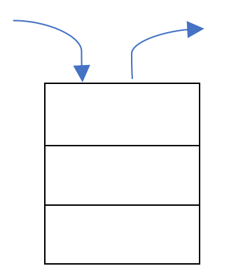
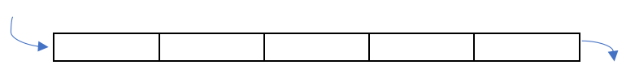

# Chapitre A.3 - Structures linéaires

## I. Les piles (Stacks)
### A. Définition
En informatique, une pile est une structure de données basée sur le principe "<span class="caché">dernier arrivé, premier sorti</span>" (<span class="caché">LIFO - Last In First Out)</span>. Ce qui signifie que le dernier élément ajouté à la pile sera le premier élément retiré de la pile.

> Le fonctionnement est identique à une pile d’assiettes : on ajoute des assiettes sur la pile et on les récupère dans l’ordre inverse, en commençant par la dernière arrivée.



### B. Exemple d'utilisation
- La fonction "annuler la frappe" d'un traitement de texte mémorise les modifications apportées au texte dans une pile.
- Dans un navigateur WEB, une pile sert à mémoriser les pages visitées. L’adresse de chaque nouvelle page visitée est ajoutée à la pile et l’utilisateur récupère l’élément en haut de la pile pour afficher la page précédente.

### C. Interface d'une pile
|Fonction / Méthode|Description|Conditions d'utilisation|
|-|-|-|
|```Pile()```|<span class="caché">Constructeur - Créer une pile vide</span>||
|```empile(elt)```|<span class="caché">ajoute elt à la pile</span>||
|```depile()```|<span class="caché">supprime le dernier élément qui a été ajouté à la pile et le renvoie</span>|<span class="caché">La pile ne doit pas être vide</span>|
|```est_vide()```|<span class="caché">Renvoie ```True``` si la pile est vide et ```False``` sinon</span>|

### D. Implémentation
Il existe une multitude d'implémentation pour une pile donc voici quelques exemples :
- [Représentation d'une pile avec une liste en programmation orientée objets](./pile_objets.py)
- [Représentation d'une pile avec une liste et des fonctions](./pile_fonctions.py)
- [Représentation d'une pile avec une liste de taille fixe en programmation orientée objets](./pile_liste_taille_fixe.py)

## II. Les files (Queue)
### A. Définition
En informatique, une file est une structure de données basée sur le principe "<span class="caché">premier arrivé, premier sorti</span>" (<span class="caché">FIFO - First In First Out)</span>. Ce qui signifie que le premier élément ajouté à la pile sera le premier élément retiré de la pile.

> Le fonctionnement est identique à une file d'attente : la première personne arrivé dans la file est la première à en sortir.



### B. Exemple d'utilisation
- Une file d'attente de connexion dans un jeux-vidéo
- Un serveur d’impression qui traite les demandes d’impression dans l’ordre où elles sont arrivées.

### C. Interface d'une pile
|Fonction / Méthode|Description|Conditions d'utilisation|
|-|-|-|
|```File()```|<span class="caché">Constructeur - Créer une file vide</span>||
|```enfile(elt)```|<span class="caché">ajoute elt à la file</span>||
|```defile()```|<span class="caché">supprime le premier élément qui a été ajouté à la file et le renvoie</span>|<span class="caché">La file ne doit pas être vide</span>|
|```est_vide()```|<span class="caché">Renvoie ```True``` si la file est vide et ```False``` sinon</span>|

### D. Implémentation
Il existe une multitude d'implémentation pour une file donc voici quelques exemples :
- [Représentation d'une file avec une liste en programmation orientée objets](./file_objets.py)
- [Représentation d'une file avec une liste et des fonctions](./file_fonctions.py)
- [Représentation d'une file avec une liste de taille fixe en programmation orientée objets](./file_liste_taille_fixe.py)
- [Représentation d'une file avec deux piles](./file_2_piles.py)
