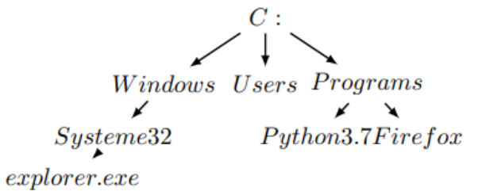
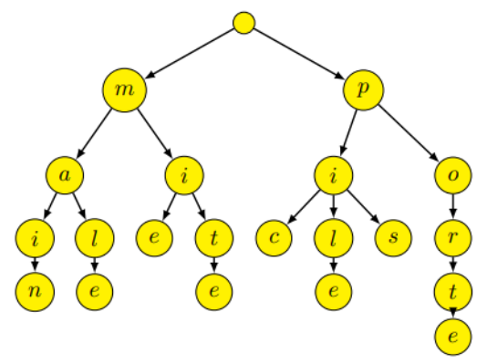
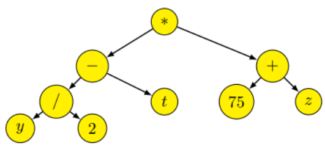
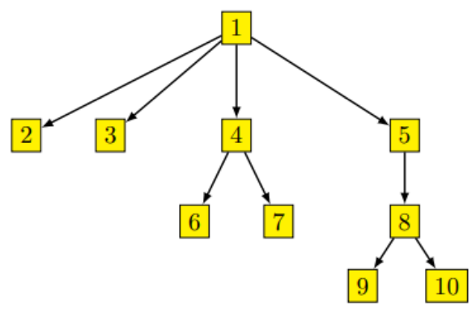
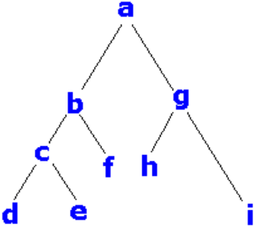
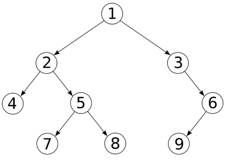

# Chapitre A.4 - Les arbres binaires
# I. Qu'est ce qu'un arbre ?
## A. Introduction
Vous avez déjà rencontré des données représentées sous la forme d’arbres par exemple :


En informatique les arbres sont des types abstraits très utilisés, notamment lorsque l’on a besoin de représentée des données ayant une structure hiérarchique.

Par exemple, représenter chaque fichier et chaque répertoire d’un ordinateur serait difficile sans une structure d’arbre.

## B. Vocabulaires
> **Définitions :**
>
> - Un arbre est un ensemble organisé de nœuds qui ont chacun un seul et unique père sauf un unique nœud qui n’en possède pas. Celui-ci est appelé racine.
> - Un arbre dont tous les nœuds sont nommées est dit étiqueté. L’étiquette représente la valeur d’un nœud.
> - Un nœud n’ayant pas de fils est appelé une feuille.
> - Les nœuds sont reliés par des branches (ou arêtes).

**Remarques :**  
Un arbre dont tous les nœuds n'ont qu'un seul fils est semblable à une liste.


> **Exercice 1**
>
> 
>
> On considère l'arbre suivant :
>
> 1. Quelle et la valeur du nœud racine ?
>
> 2. Quelle est le père du nœud ```Firefox``` ?
>
> 3. Entourer les feuilles de l'arbre.

> **Exercice 2**
> 
> On considère l'arbre est un arbre lexicographique :
>
> 
>
> 1. Entourer la racine de l’arbre
> 2. Combien de nœuds possède cet arbre ?
> 3. Combien de branche possède cet arbre ?
> 4. Combien de feuille possède cet arbre ?
> 5. Ajouter les mots « maison », « portail » et « arbre » dans cette arbre lexicographique.

> **Définitions :**
>
> - La **hauteur** (ou **profondeur**) d’un nœud est égale au nombre d’arêtes qu’il faut pour parcourir à partir de la racine pour aller jusqu’à ce nœud.
> 
> **Attention la définition de la hauteur peut varier d’un ouvrage à l’autre. La définition utilisée sera toujours rappelée lors d’une épreuve.**
>
> - La **hauteur** (ou **profondeur**) d’un arbre est égale à la profondeur du nœud le plus profond.
>
> -La **taille** d'un arbre correspond au nombre de nœuds d'un arbre.

> **Exercice 3**
>
> 
>
> 1. Quelle est la hauteur du nœud ```y``` ?
> 2. Quelle est la hauteur du nœud ```75``` ?
> 3. Quelle est la taille de l'arbre ?
> 4 Quelle est la hauteur de l'arbre ?

> **Définitions :**
> - Le vocabulaire de lien entre les nœuds de différents niveaux et emprunté au domaine de la généalogie (parents, enfants, frères, ascendant, descendant)
> - Le degré d’un nœud est égal au nombre de descendant de ce nœud.
> - Le degré d’un arbre est égal au degré maximum de ses nœuds.

> **Exercice 4 :**
>
> 
> 
> 1.  Quel est le degré du nœud ```1``` ?
> 2. Quel est le degré de l'arbre ?
> 3. 8 est le ... ... ... ... de 9 et de 10.
> 4. 6 est un ... ... ... ... de 4.
> 5. 5 est un ... ... ... ... de 9.
> 6. 6 et 7 sont des ... ... ... .
> 7. 10 est un ... ... ... de 8.

# II. Les arbres binaires
## A. Qu'est-ce qu'un arbre binaire ?
> **Définition :**
> - Un arbre binaire est un arbre de degré 2.
> - Chaque nœud dans un arbre binaire a donc <span class="caché">au plus 2</span> fils.
> - Les enfants d’un nœud sont appelés <span class="caché">sous arbre gauche</span> et <span class="caché">sous arbre droit</span>.

> **Définition récursive :**
> Un arbre binaire est :
> - <span class="caché">L'arbre vide</span>
>
> ou
> - _ 
>   - <span class="caché">Une valeur</span>
>   - <span class="caché">Un sous-arbre gauche</span>
>   - <span class="caché">Un sous-arbre droit</span>

> **Exercice 5**
> Compléter le tableau suivant :
> 
> ||(𝟏, (𝟖, 𝚫,𝚫),𝚫) |(𝟑, (𝟏, 𝚫, (𝟒, (𝟏,𝚫, (𝟓, 𝚫,𝚫)), 𝚫)),𝚫) ||
> |-|-|-|-|
> |Dessin||||
> |Taille||||
> |Hauteur||||
> |Nombre de feuilles|||||

## B. Implémentation
> **Exercice 6 :**
> L’idée est de représenter l’arbre en utilisant :
> - Un tableau vide si l’arbre et vide
> - Un tableau contenant trois éléments : la valeur du nœud racine, le sous-arbre gauche et le sous-arbre droit, sinon.
> 1. Quel arbre représente le tableau suivant : ```[ ’r’ , [ ’a’ , [ ] , [ ] ] , [ ’b’ , [ ] , [ ] ] ]``` ?
> 2. Comment représenter l’arbre suivant dans un tableau python ?
> 
> 3. Écrire une fonction qui prend un arbre en paramètre est qui renvoie vrai s’il est vide.
> 4. Écrire une fonction qui prend un arbre non vide et qui renvoie le sous-arbre gauche de l’arbre. (Lève une
exception si l’arbre est vide)
> 5. Écrire une fonction qui prend un arbre non vide et qui renvoie le sous-arbre gauche de l’arbre. (Lève une
exception si l’arbre est vide)
