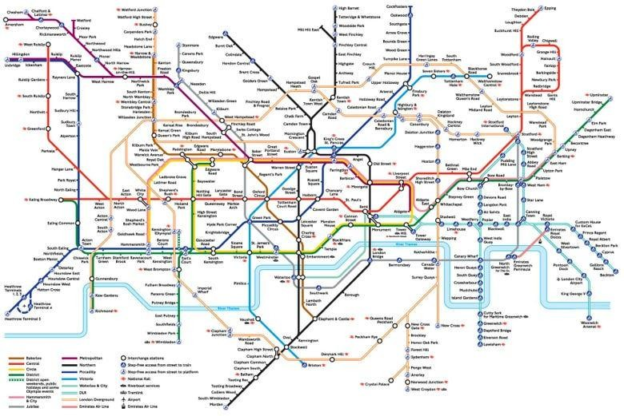
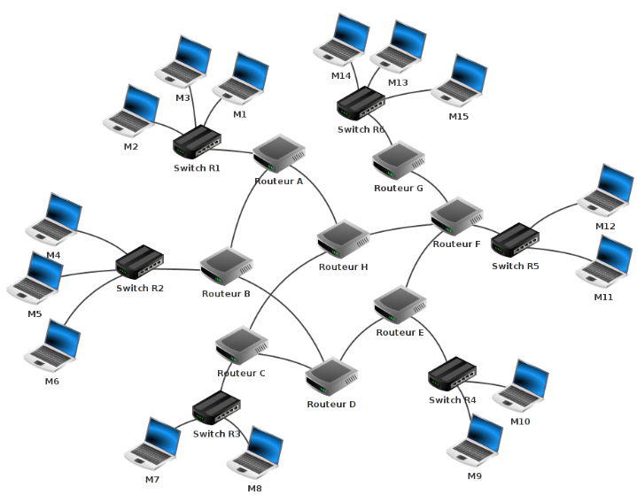
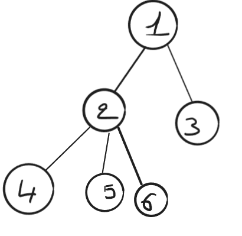
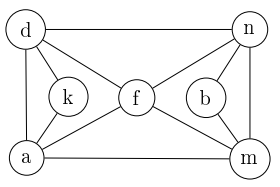

# Chapitre A.5 - Les graphes

## I. Qu'est ce qu'un graphe
### A. Introduction
La théorie des graphes est une branche fondamentale des mathématiques qui étudie les relations entre les objets. Elle permet de modéliser et d'analyser des réseaux complexes, tels que les réseaux sociaux, les réseaux de transport, et les circuits électroniques.

> **Définition :**
>
> - Un **graphe** est une structure de données composée de nœuds (appelés **sommets**) qui peuvent être liés ensemble par des **arêtes**.

Dans la vie quotidienne, on rencontre fréquemment des représentations de données sous la forme de graphe.

> **Exemple :**
>
> **Le plan du métro de Londres :**
> 
> 
> - Les sommets correspondent aux stations de métro.
> - Les arêtes correspondent  aux rail de métro.
>
> **Un réseau informatique :**
>
> 
> - Les sommets correspondent aux machines du réseaux.
> - Les arêtes correspondent  aux câbles entre les machines.

### B. Vocabulaire
> **Définitions :**
> - **L'ordre** d'un graphe correspond aux nombre de sommets du graphes.
> - Deux sommets sont **adjacents** s'ils sont reliés entre eux par une arêtes</class>.
> - Le **degré** d'un sommet correspond  aux nombres d'arêtes issues de ce sommet.
> - Un graphe est dit **complet** lorsque tous les sommets du graphe sont reliés à chaque autre sommet par une arête

> **Exercice 1 :**
>
> On considère un réseau social ayant 6 abonnés (A, B, C, D, E et F):
> - A est ami avec B, C, et D
> - B est ami avec A et D
> - C est ami avec A, E et D
> - D est ami avec tous les autres membres
> - E est ami avec C, D et F
> - F est ami avec E et D
>
> 1. Représenter cette situation sous la forme d'un graphe.
> 2. Donner le degré du graphe.
> 3. Donner l'ordre de ce graphe.
> 4. Citer deux sommets adjacents.
> 5. Ce graphe est-il complet ?
> 6. Etablir une relation entre la somme des degrés de chaque noeud et le nombre d'arêtes d'un graphe.

## II. Chemin et cycle
> **Définitions :**
>
> - Un **chemin** est une suite de sommets reliés par des arêtes.
> - La **longueur d'un chemin**  est défini par son nombre d'arêtes
> - Un **cycle** est un chamin dont le sommet de départ et d'arrivés sont identiques et dont les arêtes ne peuvent apparaître qu'une unique fois.
> - Un graphe est dit **connexe** s'il existe un chemin entre chaque pair de sommets.
> - Un graphe est dit **cyclique** s'il possède au moins un cycle et **acyclique** dans le cas contraire.

> **Exercice 2 :**
>
> 
>
> 1. Donner un chemin permettant de relier le sommet 1 au sommet 2.
> 2. Ce graphe est-il complet ?
> 3. Ce graphe est-il connexe ?
> 4. Ce graphe est-il cyclique ?
> 5. Compléter la phrase suivante : `Un graphe connexe est acyclique est un ...`

> **Exercice 3 :**
> 
> 
>
> 1. Donner un chemin permettant de relier les sommets `a` et `b`.
> 2. Donner un chemin de longueur 5 permettant de relier les sommets `m` et `k`.
> 3. Ce graphe est-il complet ? Justifier.
> 4. Ce graphe est-il connexe ? Justifier.

## III. Graphes orientés
Un graphe orienté est un graphe dans lequel les arêtes ont un sens. On indique la direction par une fléche.

**Exemple :**

> **Définition :**
>
> - Dans un graphe orienté, les arêtes sont appelés **arc**.
> - Un graphe est **fortement connexe**, s'il existe un chemin orienté depuis tout sommet u vers tout sommet v.
> - Un graphe est **faiblement connexe**, si en oubliant l'orientation des arêtes, le graphe est connexe.

## IV. Représentation d'un graphe
En informatique, pour représenter un graphe on utilise principalement deux méthodes :
### A. Matrice d'adjacence
On représente les arêtes dans un tableau à deux dimensions :

**Exemples :**

| |A|B|C|D|E|F|
|-|-|-|-|-|-|-|
|A|0|1|1|1|0|0|
|B|0|0|0|1|0|0|
|C|0|0|0|0|0|0|
|D|0|0|0|0|1|0|
|E|0|1|0|0|1|0|
|F|0|0|1|0|0|0|

| |d|n|k|f|b|a|m|
|-|-|-|-|-|-|-|-|
|d|0|1|1|1|0|1|0|
|n|1|0|0|1|1|0|1|
|k|1|0|0|0|0|1|0|
|f|1|1|0|0|0|1|1|
|b|0|1|0|0|0|0|1|
|a|1|0|1|1|0|0|1|
|m|0|1|0|1|1|1|0|

### B. Liste d'adjacences
On sauvegardes pour chaque noeud la liste de ses sommets adjacents. Dans le cas d'un graphe orientés, on pourra conserver la liste des prédécesseurs ou des successeurs.

**Exemples :**

**Graphe 1**

Listes des successeurs :

- `A - (B,C,D)`
- `B - (D)`
- `C - ()`
- `D - (E)`
- `E - (F)`
- `F - (C)`

**Graphe 2**

Listes des sommets adjacents :
- `d - (a,k,n,f)`
- `n - (d,f,b,m)`
- `k - (d,a)`
- `f - (d,n,m,a)`
- `b - (n,m)`
- `a - (d,k,f,m)`
- `m - (n,b,f,a)`

> **Exercice 4 :**
>
> 1. Proposer une interface permettant de manipuler un graphe. (Liste des méthodes de la structure de données) et la montrer au professeur.
> 2. Ecrire une classe Graphe permettant de représenter un graphe en utilisant la méthode de votre choix (listes d'adjacences ou matrice d'adjacences).
> 3. Représenter le graphe 2.