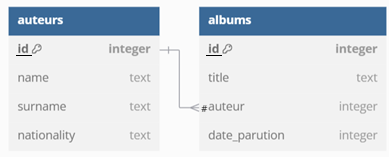

# Chapitre B.1 - Le modèle relationnel
Dans le monde actuel, la quantité d'informations à traiter par les entreprises est de plus en plus volumineuse. L'utilisation d'outils tel qu'Excel n'est plus envisageable pour traiter un si grand volume de données.

Pour traiter ces données, on a donc recours à des bases de données qui permettent d'organiser, de stocker, de mettre à jour, d'interroger des données structurées volumineuses simultanément par différents programmes ou différents utilisateurs. Les premières bases de données sont apparues dans les années 1960 et se sont développés en même temps que l'informatique. De nos jours les bases de données sont omniprésentes, particulièrement sur le WEB.

Cette année, nous étudierons le fonctionnement des bases de données relationnelles.

## I. Qu'est qu'une relation ?
### A. Définition 
- Une **relation** est une tableau à deux dimensions.
- Un **attribut** correspond à un titre de colonne.
- A chaque attribut, on définit un **domaine**, c'est à dire l'ensemble des valeurs que peut prendre un attribut.
- Un **enregistrement** est un p-uplet mettant en relation les attributs. C'est donc une ligne de la table.
- Une **entrée** est une case de la table.

### B. Exemple
Voici un table représentant la relation **auteurs** :

**auteurs**
|id|name|surname|nationality|
|-|-|-|-|
|1|Saint-Exupéry|Antoine|French|
|2|Goscinny|René|French|
|3|Rowling|Joanne|English|
|4|Shakespeare|William|English|
|5|Steel|Danielle|USA|

Cette table (relation) s'appelle auteurs, elle est composée de 4 attributs : id, name, surname, nationality

Le domaine de l'attribut **id** est "INT".

Le domaine de l'attribut **name** est "TEXT"

La valeur de l'attribut **name** de l'enregistrement dont l'**id** vaut 4 est Shakespear.

## II. Lier plusieurs tables
### A. Définition 
- Un **schéma relationnel** est l'ensemble des relations d'une base de données.
- Les liens entre les relations sont stockés via des clefs primaires et étrangères dans les relations.
- Une **clé primaire (Primary Key)** identifie de manière unique un enregistrement d'une relation. Elle ne peut être vide (**NULL**). Elle peut-être composée d'un ou plusieurs attributs.
- Une **clé étrangère (Foreign Key)** référence la clé primaire d'une autre relation. Attention, les entrées des attributs référencés doivent déjà exister.

### B. Exemple
Voici la relation **albums** de la même base de données que la relation **auteurs** précédente.

**albums**
|id|title|auteur|date_parution|
|-|-|-|-|
|1|Harry Potter et l’Ordre du Phénix|3|2003|
|2|Roméo et Juliette|4|1595|
|3|Sortie du Domaine des dieux|2|1971|
|4|Les Animaux fantastiques|3|2001|
|5|Le Petit Prince|2|1943|
|6|Iznogoud et l’ordinateur magique|2|1970|
|7|Hamlet|4|1600|

L'attribut **auteur** de la relation **albums** est une **clef étrangère**, elle fait référence à l'attribut **id** de la table **auteurs**.
La table **albums** possède une **clé étrangère** qui référence la **clé primaire** de la table **auteurs**. 
Il y a donc une association entre la relation **auteurs** et la relation **albums**.

On peut établir le schéma relationnel suivant : 

Le schéma relationnel peut également être écrit sous la forme suivante :

**auteurs**(<u>id</u>, name, surname, nationality)  
**albums**(<u>id</u>, title, #auteur, date_parution)

## II. Les contraintes d'intégrités
Il est important d'assurer la cohérence et donc l'intégrité des données présentes dans une base de données. Cela consiste à s'assurer que les données stocker sont cohérentes entre elles, c'est à dire qu'elle respectent toutes les règles exigées par le concepteur de la base de données.
- **contrainte d'intégrité** : ensemble de règles permettant de garantir la cohérence des données dans une base de données

Les contrainte d'intégrité sont vérifiées par le **système de gestion de bases de données** (**SGBD**). Si l'une des règles d'intégrité n'est pas respecté, le SGBD signalera une erreur et n'autorisera pas l'écriture des nouvelles données. Il existe trois type de contraintes d'intégrité : 
- **Contrainte de relation :** Chaque relation doit être identifié par une clé primaire unique et non nulle. La clé primaire peut être composé d'un seul attribut ou d'un ensemble d'attributs.

Exemple : Dans la relation **auteurs** l'attribut <psan class="caché">id est unique et non nulle, il est donc la clé primaire de la relation **auteurs**.

- **Contrainte de domaine** : Toute les valeurs d'un attribut, doivent appartenir au domaine défini pour cette attribut.

Exemple : Le domaine de l'attribut **date_parution** de la relation **albums** est **integer**. Toutes les valeurs de cette attributs doivent être des **entier**.

- **Contrainte de référence** : Une clé étrangère dans une relation doit être une clé primaire dans une autre. De plus le domaine de valeurs de ces deux clés doit être identique. Enfin la valeur d’une clé étrangère doit exister dans la clé primaire qui y fait référence.