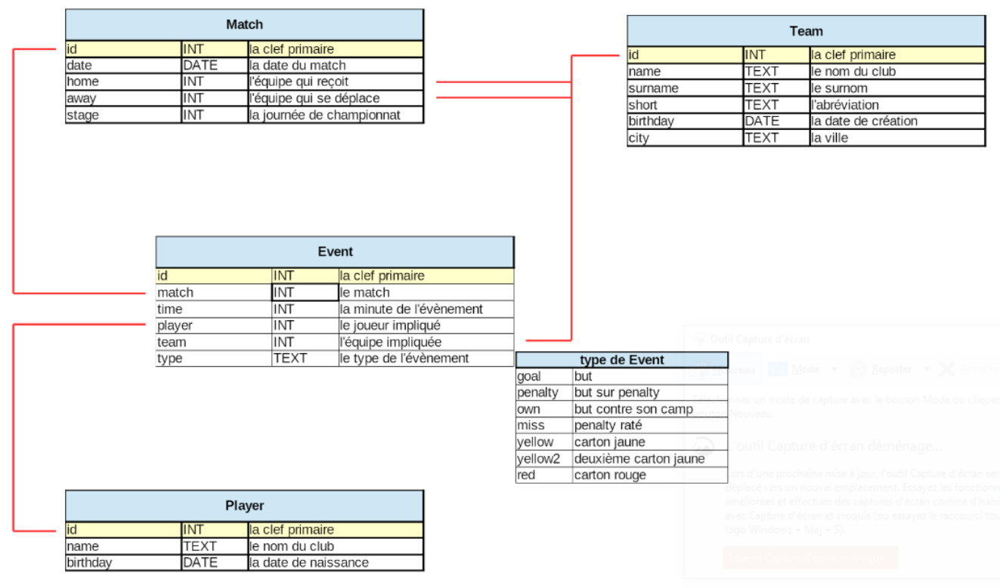

# Chapitre B.2 - Le langage SQL - Requêtes de sélection simples

## I. Introduction au langage SQL
Maintenant que nous savons comment sont organisées les bases de données et quelles contraintes permettent de d’assurer qu’elle reste conforme. Nous allons apprendre à interagir avec elle, pour interagir avec une base de données, le langage utilisé et le langage SQL (Select Query Language). La première version du langage SQL a été développée chez IBM en 1970 et a été adoptée comme recommandation par l’Institut de normalisation américaine (ANSI) en 1986.

Le langage SQL est un langage déclaratif, cela signifie qu'il permet de décrire le résultat escompté, sans décrire la manière de l'obtenir.

L’ensemble des Système de Gestion de Bases de Données embarque un optimiseur de requêtes. Cela signifie que **deux requêtes attendant le même résultat, iront toujours à la même vitesse** pour s’exécuter indépendamment de la façon dont elle est écrite.

## II. Écrire une requête de sélection
Dans ce cours, pour utiliser des requêtes SQL, nous utiliserons le site : https://sqlite.com/

Celui-ci permet d'importer ou de créer un fichier permettant de sauvegarder le contenu d'une base de données. Ceci nous permettra de réaliser des requêtes sans devoir installer et utiliser un serveur de bases de donnés.

Dans la suite du cours, nous nous baserons sur le schéma relationnel suivant :

### A. Format d'une requête de sélection
Une requête de sélection est une requête qui permet d'interroger une base de données afin d'y lire des informations.

*Pour afficher tous les enregistrements d'une table, on exécute la requête suivante :*
```sql
SELECT * FROM nom_de_la_table;
```

> **Q.1 - Quelle requête SQL permet d'afficher l'ensemble des colonnes concernant l'ensemble des joueurs ? Tester votre requête.**

> **Q.2 - Quelle est le nom du premier joueur qui s'affiche dans les résultats de votre requête ?**
- Le mot-clé ```SELECT``` permet d'indiquer que la requête effectuée est une requête de sélection.
- Il est suivi des colonnes de la base de données à afficher séparé par des virgules. (Le jeton ```*``` signifie toutes les colonnes)
- Le mot-clé ```FROM``` suivi du nom d’une table permet d’indiquer la table dans laquelle on va chercher les colonnes.

> **Q.3 - En modifiant le caractère ```*```, faite en sorte de lire uniquement le nom des joueurs. Écrire votre requête.**

> **Q.4 - Quelle requête permet de lire toutes les colonnes de la table Match ?**

> **Q.5 - Quelle requête permet de lire la date et le stage de chaque match ?**

> **Q.6 - Quelle est la date du premier match affiché par votre requête ?**

### B. Les conditions
Parfois, nous ne souhaitons pas obtenir toutes les lignes d'une base de données. Peut-être que nous ne sommes intéressés que par les match qui se sont déroulés le 25-08-2015.

- *Pour ajouter une condition à la recherche, il faut ajouter la mot-clé ```WHERE``` suivis des conditions à respecter.*
- *Lorsqu’une condition devient trop complexe, il est préférable de l’écrire sur plusieurs lignes.*

```sql
SELECT nom_colonne1, nom_colonne2
FROM nom_table
WHERE condition;
```

Par exemple, pour rechercher les matchs qui se sont déroulé le 29 Août 2015, on exécute la requête suivante : 
```sql
SELECT *
FROM Match
WHERE date = "2015-08-29";
```

> **Q.7 - Quelle requête permet d’obtenir les identifiants des matchs s’étant déroulé AVANT le 29 Août 2015 ?**

> **Q.8 – Indiquer les identifiants obtenus à l'aide de la requête précédente.**

> **Q.9 – Quelle est l’instruction permettant d’obtenir l’identifiant de l’équipe ayant pour surnom : « Les verts » ?**

*Il est possible de cumuler plusieurs conditions dans une seule clause ```WHERE```, pour cela, il faut ajouter les mots-clés ```AND``` ou ```OR``` entre chacune des conditions.

```sql
SELECT nom_colonne1, nom_colonne2
FROM nom_table
WHERE condition1
AND condition2;
```

> **Q.10 – Quelle est l’instruction permettant d’obtenir le nom de tous les joueurs nés en 1997 ?**

> **Q.11 – Quelle est l’instruction permettant d’obtenir l’identifiant des joueurs ayant obtenu un carton rouge au cours des différents matchs.**

> **Q.12 – Quelle instruction permet d’obtenir le temps pour chaque carton rouge et pour chaque carton jaune ?**

> **Q.13 – Combien de cartons ont été distribué après les 90 minutes de jeu ?**

### C. Trier les réponses
La clause ```ORDER BY``` permet de trier les réponses de la requête.
```sql
SELECT nom_colonne
FROM nom_table
ORDER BY nom_colonne_a_trier
```

> **Q.14 – Quelle requête permet d’obtenir les dates des différents matchs triés par ordre croissant ?**

> **Q.15 – Quelle est donc le jour du premier match enregistré ?**

*Ajouter le mot-clé ```desc``` à la fin de la clause permet d'inverser l'ordre de tri.*

> **Q.16 – Quelle requête permet d’obtenir les dates des différents matchs triés par ordre décroissant ?**

> **Q.17 – Quelle est donc le jour du dernier match enregistré ?**

### D. La clause DISTINCT
Lorsque l’on sélectionne uniquement les dates des matchs, nous nous retrouvons donc avec beaucoup d’enregistrement identique. 

Pour éviter cela et conserver qu'une seule ligne pour chaque doublon, il est possible d’ajouter la clause DISTINCT comme ceci :
```sql
SELECT DISTINCT date
FROM Match
```

> **Q.18 – Après de combien de temps de match le carton rouge le plus rapidement donné a-t-il était donné ?**

> **Q.19 – Quelle requête vous a permis de répondre à la question précédente ?**

### E. Quelques fonctions SQL
Il existe quelques fonctions SQL qui permettent d’obtenir certaines informations sur les données de la base.

Quelques exemples de fonctions utiles :
#### Compter les enregistrements
La fonction ```COUNT()``` permet de compter le nombre d'enregistrements.

La requête suivante permet par exemple de connaître le nombre d'enregistrements de la table Event.
```sql
SELECT COUNT(*)
FROM Event
```

> **Q.20 – Quelle requête permet de connaître le nombre de cartons qui ont été distribués après la 90 ème minutes de jeu ? (Sans les compter à la main)**

> **Q.21 – Quelle requête permet de connaître le nombre de jour où se sont déroulé les matchs ?**

#### Maximum et minimum
La fonction ```MIN()``` permet d’obtenir la plus petite des valeurs et la fonction ```MAX()``` permet d’obtenir le maximum des valeurs.

La requête suivante permet d’obtenir la date de naissance et le nom du joueur le plus ancien.
```sql
SELECT MIN(birthday), name
FROM Player
```
La requête suivante permet d’obtenir la date de naissance et le nom du joueur le plus jeune.
```sql
SELECT MAX(birthday), name
FROM Player
```

> **Q.22 – En vous aidant cette fois-ci des fonctions MIN et MAX, répondre aux questions 15, 17 et 18.**

#### Somme et moyenne
La fonction ```AVG()``` permet d’obtenir la moyenne des enregistrements et la fonction ```SUM()``` permet d’obtenir la somme de tous les enregistrements.

> **Q.23 – Quelle est le temps moyen auquel est donné un carton rouge ? (Écrire la requête)**

### F. La clause GROUP BY
La clause ```GROUP BY``` est utilisée en SQL pour grouper plusieurs résultats et utiliser une fonction de totaux sur un groupe de résultats.

Par exemple, la requête suivante permet d’obtenir les dates de match et le nombre de matchs pour chacune de ces dates. (```as NbMatch``` permet de modifier le nom de la colonne du résultat)
```sql
SELECT COUNT(id) as NbMatch, date
FROM Match
GROUP BY date
```

> **Q.24 – Écrire une fonction qui affiche les identifiants des matchs et le nombre de cartons donné pour chaque match.**