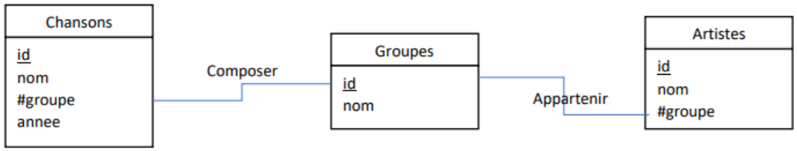

# Fiche d'exercices - **Chapitre B.2 - Le langage SQL - Requêtes de sélection simples**

## Exercice 1

Pour répondre aux questions de l'exercice, on se basera sur le schéma relationnel précédent.
1. Donner les attributs de la table ```Chansons```
2. La table ```Artiste``` contient-elle une clé étrangère ? Si oui, donner la clé étrangère et la clé primaire qu'elle référence.
3. Quelle requête permet d'obtenir le nom de tous les artistes ?
4. Quelle requête permet d'obtenir l'id et le nom des artistes appartenant au groupe ayant pour identifiant 5.
5. Quelle requête permet d'obtenir le nom des chansons triées par ordre croissant d'année de sortie ?
6. Que fait la requête suivante ?
```sql
SELECT nom
FROM Chansons
WHERE annee = 2021
```
7. Que fait la requête suivante :
```sql
SELECT COUNT(*), groupe
FROM Chansons
GROUP BY groupe
``` 
8. Quelle requête permet d'obtenir le nombre de membres au sein de chaque groupe ?

## Exercice 2

Pour répondre aux questions de l'exercice, on se basera sur le schéma relationnel précédent.
1. Expliquer pour quelle raison la clé primaire de la table Temps et représentée par deux attributs. 
2. Quelle requête permet d'obtenir les noms et prénoms de chacun des coureurs par ordre du code des équipes ?
3. Quelle requête permet d'obtenir le numéro de dossard des coureur ayant fait l'étape numéro 5 par ordre d'arrivée ?
4. Quelle requête permet d'obtenir les villes de départ et d'arrivée de chaque étape qui dure entre 10 et 15 km ?