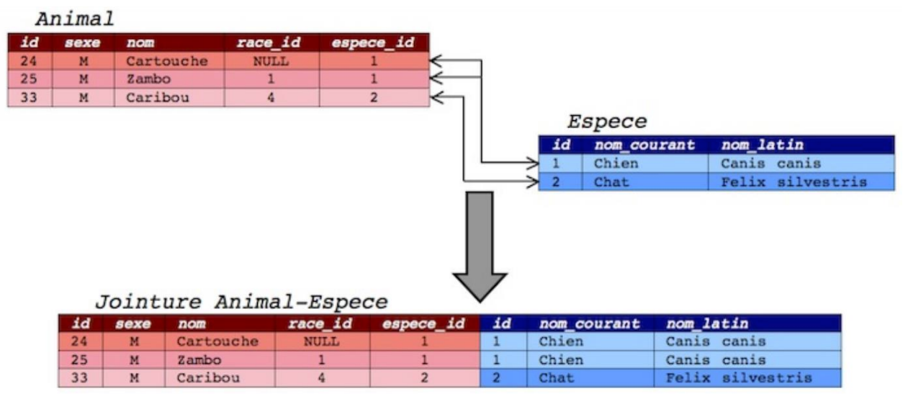

# Chapitre B.3 - Le langage SQL - Les jointures
Dans cette leçon, nous utiliseront les relations suivantes :

Animal (__id__, #espece_id, sexe, race_id, nom)  
Espece (__id__, nom_courant, nom_latin, description)

1. Dessiner le schéma relationnel correspondant.

## Les jointures
Une jointure SQL est une opération qui permet de combiner des données de différentes tables dans une base de données relationnelle, en utilisant une requête SQL. Elle est très utile pour obtenir des informations à partir de plusieurs tables en une seule requête, et est largement utilisée dans les applications de bases de données.

Il existe plusieurs types de jointures :
- INNER JOIN permet de <span class="caché">conserver les données communes au deux tables</span>.
- LEFT JOIN permet de <span class="caché">conserver toutes les données présente dans le première table même s'il n'y a pas de correspondance avec la seconde</span>.
- RIGHT JOIN permet de <span class="caché">conserver toutes les données présente dans le première table même s'il n'y a pas de correspondance avec la seconde</span>.
- OUTTER JOIN permet de <span class="caché">conserver les données des deux tables même s'il n'y a pas de correspondance</span>.

Peut importe le type jointure utilisé, l’utilisation est similaire. Pour utiliser une jointure dans une requête SQL, il faut spécifier les tables à joindre, ainsi que les clés étrangère et primaire qui serviront à réaliser la jointure.

```sql
SELECT attribut1, attribut2
FROM table1
INNER JOIN table2 ON table1.attribut3 = table2.attribut4
WHERE ………………. ;
```

**Exemple :**


**Exercice :**

Requête SQL :
```sql
SELECT Animal.id, Animal.nom,
FROM Animal
JOIN Espece ON Espece.id = Animal.espece_id
WHERE sexe = ‘F’
AND Espece.nom_courant IN (‘Tortue’, ‘Perroquet’)
```

Objectif de la requête : ……………………………………………………………………………………………………………………………………

2. Objectif de la requête : Donner le nom latin de l’espèce de Cartouche

Requête SQL : 
……………………………………………………………………………………………………………………………………

……………………………………………………………………………………………………………………………………

……………………………………………………………………………………………………………………………………

……………………………………………………………………………………………………………………………………