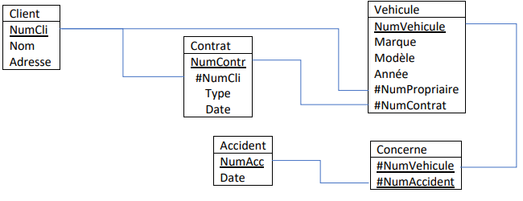

# Fiche d'exercices - **Chapitre B.3 - Le langage SQL - Les jointures**
## Exercice 1
On considère le schéma relationnel suivant :



1. Requête SQL :
```sql
SELECT Marque, Modèle
FROM Vehicule
WHERE Année = 2022;
```

Objectif de la requête : ...................................................................

2. Requête SQL :
```sql


```

Objectif de la requête : Obtenir le numéro de tous les contrats signés en 2019.

3. Requête SQL :
```sql
SELECT Marque, Modèle
FROM Vehicule
INNER JOIN Client ON NumProprietaire = NumCli
WHERE Nom = ‘Paul’;
```

Objectif de la requête : ...................................................................

4. Requête SQL :
```sql


```

Objectif de la requête : Obtenir le nombre de contrats concernant un véhicule de la marque Porsche.

5. Requête SQL :
```sql


```

Objectif de la requête : Obtenir le nom des propriétaires de véhicule, le Modèle de leur voiture ainsi que le numéro de contrat.

6. Requête SQL :
```sql
SELECT MAX(COUNT(*))
FROM Vehicule
GROUP BY Année
```

Objectif de la requête : ...................................................................

7. Requête SQL :
```sql


```

Objectif de la requête : Obtenir le nombre d'accidents réalisé en 2024.

8. Requête SQL :
```sql


```

Objectif de la requête : Obtenir la date du dernier accident concernant un véhicule assuré par ‘Yvan’.

9. Requête SQL :
```sql
SELECT NumVehicule
FROM Vehicule
LEFT JOIN Concerne ON Concerne.NumVehicule = Vehicule.NumVehicule
WHERE NumAccident = NULL
```

Objectif de la requête : ...................................................................

10. Requête SQL :
```sql


```

Objectif de la requête : Obtenir l’ensemble des véhicules ayant un contrat d’assurance de type ‘Tous risque’ ayant eu un accident les deux dernière années (2023 et 2024).

## Exercice 2
On considère la base de données BD_AIRBASE suivante :

- PILOT (**NumP**, NameP, Address, Salary)
- AIRPLANE (**NumAP**, NameAP, Capacity, Localisation)
- FLIGHT(**NumF**, #NumP, #NumAP, Dep_T, Arr_T, Dep_H, Arr_H)

1. Donnez la liste des avions dont la capacité est supérieure à 350 passagers.
2. Quels sont les numéros et noms des avions localisés à Nice ?
3. Quels sont les numéros des pilotes en service et les villes de départ de leurs vols ?
4. Donnez toutes les informations sur les pilotes de la compagnie.
5. Quel est le nom des pilotes domiciliés à Paris dont le salaire est supérieur à 15000 € ?
6. Quels sont les avions (numéro et nom) localisés à Nice ou dont la capacité est inférieure à 350 passagers ?
7. Liste des vols au départ de Nice allant à Paris après 18 heures ?
8. Quels sont les numéros des pilotes qui ne sont pas en service ?
9. Quels sont les vols (numéro, ville de départ) effectués par les pilotes de numéro 100 et 204 ?