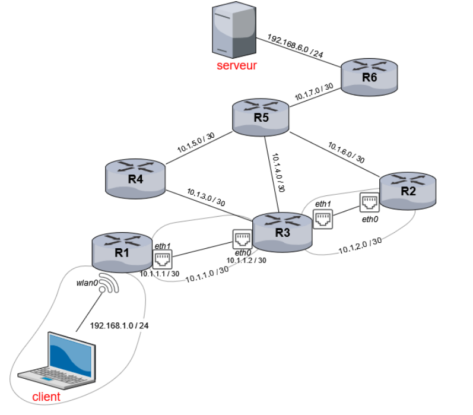

# Chapitre C.2 - Protocole de routage
## I. Table de routage

Une table de routage permet d’acheminer les paquets entre différents appareils distants.
Une table de routage se base sur les principes suivants :

-	Une table de routage indique, pour chaque destination le chemin à emprunter, c’est-à-dire l’adresse IP du prochain routeur ou appareil vers lequel émettre les paquets. Cette adresse IP est appelée passerelle.
-	Chacune des interfaces de connexion d’un routeur est son adresse IP au sein du réseau correspondant. 
-	Une table de routage comporte donc pour chaque destination, les adresses IP de la passerelle est de l’interface associé.
-	Lorsqu’un routeur reçoit un paquet, il parcourt les lignes de sa table de routage et garantit la correspondance la plus précise entre l’adresse figurant dans la table et l’adresse de destination.

## II. Les protocoles de routages
Cette année, nous allons étudier deux algorithmes de routage. Un algorithme de routage permet de définir la table de routage des différents routeur présents sur le réseau.

### A. Le protocole RIP (Routing Information Protocol)
Le protocole RIP est l’un des premiers algorithmes utilisés pour établir les tables de routages des routeurs. Le protocole RIP se base sur le nombre de saut entre deux destinations. C’est-à-dire le nombre de routeurs qu’il faut traverser entre les deux destinations.

Les règles du protocole RIP sont les suivantes : 
1.	Au démarrage du routeur, la table de routage de celui-ci contient uniquement les informations concernant les voisins directs de celui-ci.

Exemple : 

Initialement, la table de routage du routeur R1 contient uniquement les réseaux 192.168.1.0 et 10.1.1.0

La table du routeur R3 au démarrage sera :
|Destination|Passerelle|Interface|Métrique|
|-|-|-|-|
|10.1.1.0/30|10.1.1.2|10.1.1.2|0|
|10.1.3.0/30|10.1.3.1|10.1.3.1|0|
|10.1.4.0/30|10.1.4.1|10.1.4.1|0|
|10.1.2.0/30|10.1.2.1|10.1.2.1|0|

2. Chaque routeur envoie périodiquement, à tous ses voisins (routeurs adjacents), un message contenant :

-	La liste de toutes les adresses de réseaux qu’il connaît (ses voisins directs et ceux qu’il a reçu auparavant) 
-	Leur métrique (le nombre de sauts pour les atteindre)

Ce couple d’informations (réseau, métrique) est appelé vecteur de distance

3.	A chaque réception d’un message, un routeur met sa table de routage à jour. Quatre cas peuvent se présenter.
-	Il découvre une nouvelle route vers un sous-réseau qu’il ne connaît pas. Dans ce cas, le routeur Ajoute le nouveau réseau dans sa table de routage
-	Il découvre une nouvelle route plus courte vers un sous-réseau qu’il connaît déjà. Dans ce cas, le routeur Met à jour les informations de sa table de routage
-	Il découvre une nouvelle route plus longue vers un sous-réseau qu’il connaît déjà. Dans ce cas, le routeur Ne fait rien
-	Il reçoit une route existante dans sa table (passant par le même voisin) mais plus longue. Cela signifie que la route s’est allongée.
Dans ce cas, le routeur met à jour les informations de sa table de routage

#### REMARQUES
- On peut prendre comme nombre de sauts – la métrique – le nombre de routeurs traversés, ou bien le nombre de trajets entre routeurs. Les deux quantités diffèrent de 1.
- L’algorithme utilisé pour déterminer le cheminement des messages avec le protocole RIP est l’algorithme de Bellman-Ford, qu’on ne détaillera pas plus. avec une métrique infinie, c’est à dire avec 16 sauts. Quand un routeur détecte qu’un réseau est inaccessible, il met donc à jour sa table avec 16 sauts pour cette adresse.
- Le protocole RIP considère qu’un routeur est tombé en panne s’il n’a pas envoyé sa table depuis 180 secondes. Les routes passant par ce routeur sont alors retirées des tables

#### INCONVÉNIENTS :
- Il génère un trafic important puisque les routeurs se partagent les tables de routages très régulièrement
- Le protocole RIP est configuré pour se limiter à un nombre maximum de 15 sauts, ce qui le réserve à des réseaux de petites taille.
- Le protocole RIP ne prend pas en compte le débit des liaisons entre deux routeurs

#### AVANTAGES : 
- Le protocole RIP est très simple à mettre en place.
- Le protocole RIP est très efficace sur des réseaux de petite taille.

### B. OSPF (Open shortest path first)
Le protocole OSPF a été construit en 1987 pour répondre aux inconvénients de RIP. Il est plus complexe que RIP, seules les grandes lignes en seront données. Ce protocole utilise comme métrique la bande passante, plus pertinente que le nombre de saut. L’unité de coût choisie est donnée par le formule suivante : 

$cout=\frac{C}{(bande passante en bit/s)}$  , on prend généralement $C=10^9$

### Le principe du protocole OSPF
Le réseau est segmenté en plusieurs zones, dites zones autonomes, reliées entre elles par une aire dorsale d’adresse 0.0.0.0. C’est donc cette adresse que l’on utilisera pour consulter un site distant sur le web par exemple. 

Des routeurs spécialisés connectent entre eux les différentes zones. A l’intérieur d’une zone, chaque routeur émetteur envoie des messages ‘ Hello ‘ à tous ses voisins. Ces messages contiennent son identificateur (qui peut être par exemple la plus grande adresse IP de tous ses sous-réseaux), ainsi que les identificateurs des voisins déjà connus. Les voisins répondent par un message qui peut être de deux types. 

Si le routeur est déjà connu, le message sera un simple accusé de réception. 
S’il n’est pas connu, le voisin renvoie les informations qu’il connaît sur la topologie du réseau .

Le coût du lien à un voisin est mesuré expérimentalement, et est également transmis. Après plusieurs messages, tous les routeurs de la zone connaissent toute la topologie du réseau. La deuxième étape est le calcul des chemins optimaux. Ce calcul se fait avec l’algorithme de Dijkstra.

### REMARQUES
-	OSPF est le protocole conseillé pour les zones autonomes 
-	Il existe une version centralisée dans laquelle un routeur est désigné pour centraliser les informations sur le réseau. Il centralise les informations pour éviter de surcharger le réseau

### INCONVÉNIENTS
- L’algorithme est très performant pour neutraliser les boucles.
- Les échanges sur l’état des liens des routeurs voisins permettent à chaque routeur de déterminer le plus court chemin vers chaque destination directement 

### AVANTAGES
- L’algorithme pour élire les rôles spécifiques des différents routeurs est complexe.
- L’algorithme est gourmand donc occupe les processeurs des routeurs.	 
