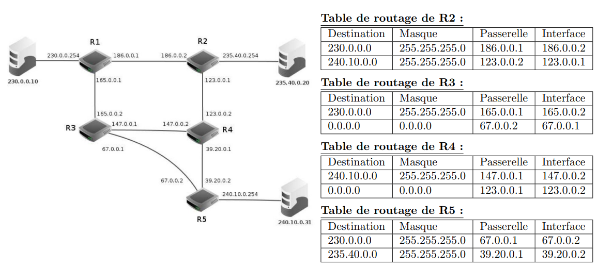
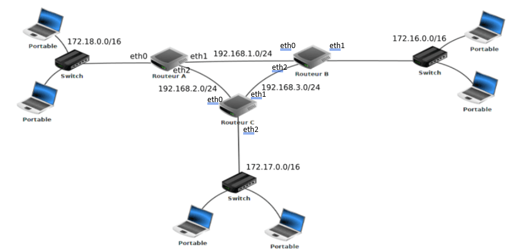
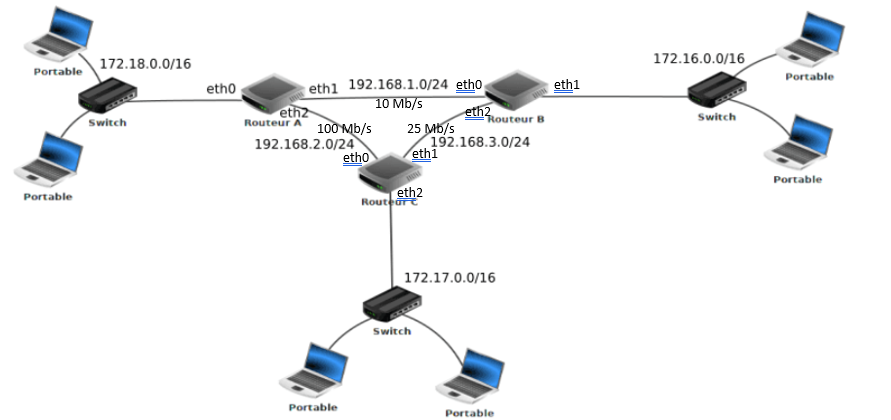
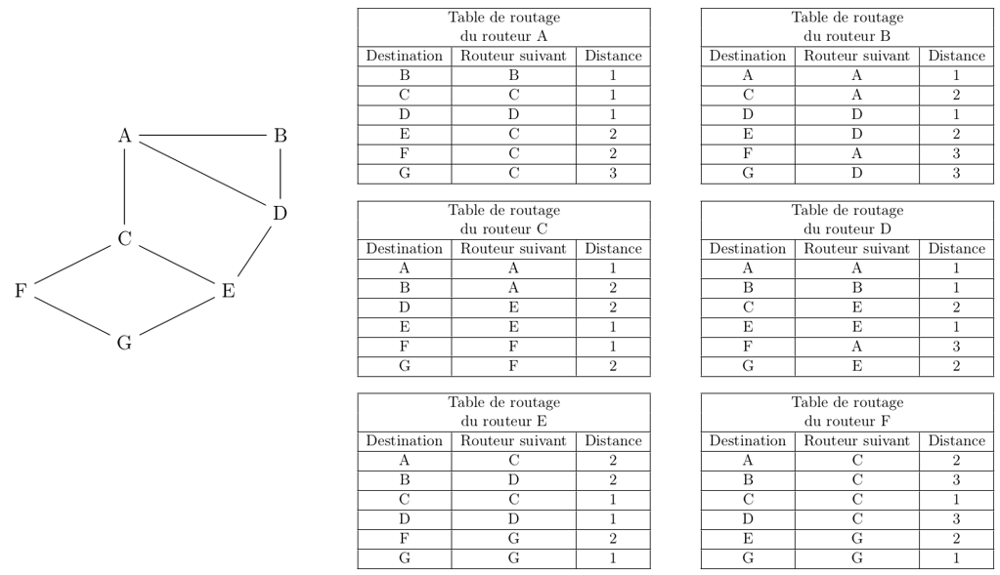
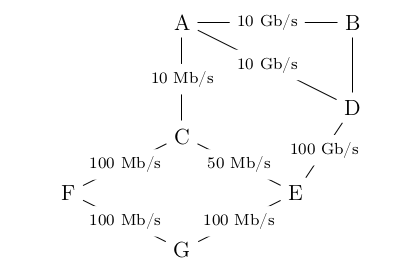

# Fiche d'exercices - **Chapitre C.2 - Protocoles de routage**
## Exercice 1 : 
Chez un particulier, la table de routage de son ordinateur connecté à sa box est la suivante.

|Destination|Masque|Passerelle|Interface|
|-|-|-|-|
|192.168.1.5|255.255.255.255|127.0.0.1|127.0.0.1|
|192.168.1.0|255.255.255.255|192.168.1.254|192.168.1.5|
|127.0.0.0|255.0.0.0|127.0.0.1|127.0.0.1|
|0.0.0.0|0.0.0.0|192.168.1.254|192.168.1.5|

1.	Quelle est l’adresse IP de cet ordinateur ?
2.	Quelle est l’adresse IP de la box internet ?
3.	Combien d’appareils supplémentaires peuvent être connectés à la box ?

## Exercice 2 : 
On a représenté ci-dessous un réseau constitué de routeurs (R1, R2, R3, R4 et R5) connectés à différents sous-réseaux, en précisant les adresses IP de chacune des interfaces des routeurs. On donne les tables de routage des routeurs R2, R3, R4 et R5 suivantes.

1.	Proposer une table de routage possible du routeur R1 afin que l’ordinateur d’adresse IP 230.0.0.10 puisse communiquer avec ceux d’adresse IP 235.40.0.20 et 240.10.0.31.

2.	On exécute la ligne de commande ci-dessous depuis l’ordinateur d’adresse IP 240.10.0.31. :
- ping 235.40.0.20  
décrire la route empruntée par les paquets échangés (aller et retour).

## Exercice 3

1. Donner la table de routage de chacun des routeur suivant en utilisant le protocole RIP.

2.	Quel est, d’après la table de routage, le chemin qui sera emprunté par un paquet pour aller d’une machine ayant pour adresse IP 172.18.1.1/16 à une machine ayant pour adresse IP 172.16.5.3/16 ?

## Exercice 4

1. Donner la table de routage de chacun des routeur suivant en utilisant le protocole OSPF.

2.	Quel est, d’après la table de routage, le chemin qui sera emprunté par un paquet pour aller d’une machine ayant pour adresse IP 172.18.1.1/16 à une machine ayant pour adresse IP 172.16.5.3/16 ?

## Exercice 5
On considère un réseau composé de plusieurs routeurs reliés de la façon suivante :

QUESTION 1

1.	Le routeur A doit transmettre un message au routeur G, en effectuant un nombre minimal de sauts. Déterminer le trajet parcouru.
2.	Déterminer une table de routage possible pour le routeur G obtenu à l’aide du protocole RIP.

QUESTION 2

Le routeur C tombe en panne. Reconstruire la table de routage du routeur A en suivant le protocole RIP.

Contrairement au protocole RIP, l’objectif n’est plus de minimiser le nombre de routeurs traversés par un paquet. La notion de distance utilisée dans le protocole OSPF est uniquement liée aux coûts des liaisons. L’objectif est alors de minimiser la somme des coûts des liaisons traversées.

On a rajouté sur le graphe représentant le réseau précédent les différents débits des liaisons. 

On rappelle que $1 Gb/s = 1 000 Mb/s = 10^9  bits/s$.

QUESTION 3

1. Vérifier que le coût de la liaison entre les routeurs A et B est 0,01.
2. La liaison entre le routeur B et D a un coût de 5. Quel est le débit de cette liaison ?

QUESTION 4

Le routeur A doit transmettre un message au routeur G, en empruntant le chemin dont la somme des coûts sera la plus petite possible. Déterminer le chemin parcouru. On indiquera le raisonnement utilisé.
