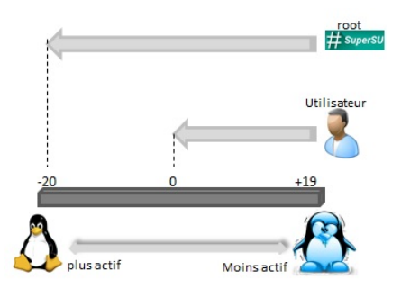

# Chapitre C.3 Gestion des ressources et des processus par un système d’exploitation

## I. Notion de programme et de processus
Un programme est écrit à l’aide d’un langage de programmation (on parle de « code source »). Pour être compréhensible par l’ordinateur, le programme est transformé en langage machine afin de pouvoir être exécuté.

Un processus est un programme en cours d’exécution sur l’ordinateur. Le processus correspond à l’exécution du programme par un ordinateur. 

## II. L'état d'un processus
Aujourd’hui, chaque système d’exploitation est capable de gérer l’exécution de plusieurs processus en « même temps ». En réalité, chaque processus s’exécute à tour de rôle suffisamment rapidement pour que l’utilisateur ne puisse pas s’en rendre compte. Pour réussir cet exploit, le système d’exploitation attribue un état à chaque processus.

Il existe trois états différents : 
-	A la création du processus, celui-ci est dans l’état **prêt**. Le processeur ne peut « s’occuper » que d’un unique processus à la fois. Le processus reste en attente jusqu’à ce que le processeur lui soit disponible.
-	Une fois que le processeur est disponible, un processus dans l’état prêt est « choisi » par le processeur pour continuer son exécution. Le processus en cours d’exécution sur le processeur est dit dans l’état **élu**.
-	Le processus élu, celui en cours d’exécution peut demander l’utilisation d’une ressource qui n’est pas disponible (périphérique, données sur le disque dur, etc…). Le processus ne pouvant pas continuer son exécution, il est placé en attente. On dit qu’il est dans l’état **bloqué** jusqu’à ce que la ressource dont il a besoin soit libérée.

C’est le système d’exploitation qui gère et attribue à chacun de ces processus leur état. On dit que c’est lui qui gère l’ordonnancement des processus. C’est notamment lui qui priorise ou non certains processus par rapport à d'autres. L’élément du système d’exploitation qui à pour rôle d’orchestrer est de déterminer les processus prioritaires est appelé : <span class="caché">ordonnanceur</span>.

Son rôle est de : 
-	 De minimiser le temps de traitement du processus d’un utilisateur
-	 De garantir l’équité entre les différents utilisateurs
-	 D’optimiser l’utilisation des ressources
-	 D’éviter les blocages

Il existe plusieurs algorithmes permettant de définir quel processus doit être élu par l’ordonnanceur dont voici quelques exemples simples : 

|Algorithme|Principe|Remarques|
|-|-|-|
|FCFS First-come,first-served premier arrivé, premier servi|Les processus sont stockés dans une file. Le premier arrivé est admis immédiatement et s’exécute tant qu’il n’est pas bloqué ou terminé. Lorsqu’il se bloque, le processus suivant commence à s’exécuter et le processus bloqué va se mettre au bout de la file d’attente. Ainsi de suite . . .|l’algorithme est simple, l'ordonnancement est équitable mais le processus qui utilise davantage de temps est favorisé par rapport à ceux qui font beaucoup d’appels aux ressources.|
|l’algorithme du « plus court d’abord »|Le processus dont le temps de traitement sera supposé le plus court est prioritaire.|Il n'est pas toujours réalisable, car il est difficile d’évaluer le temps d’exécution d’une tâche avant son début.|
|l’algorithme du tourniquet|Chaque processus reçoit un quantum de temps, une fois le quantum épuisé, le processus passe la main et retourne dans la file d’attente.|En général, dans les OS multitâches, c’est cet algorithme qui est utilisé, avec un quantum entre 20 ms et 50 ms.|
|L’ordonnancement avec priorité.|Une valeur de priorité est assignée à chaque processus, la priorité pouvant varier dynamiquement. Par exemple, pour ne pas encombrer la mémoire avec des processus qui passent beaucoup de leur temps à attendre des E/S, on leur accorde une priorité d’autant plus grande qu’ils ne consomment qu’une petite fraction de leur quantum.|Il est nécessaire d’ajuster les priorités au fur et à mesure.|

**EXERCICE 1**
Les trois processus suivants doivent être effectués simultanément sur un ordinateur à un seul microprocesseur.
|Processus 1|Processus 2|Processus 3|
|-|-|-|
|Instruction 1|Instruction 1|Instruction 1|	
|Instruction 2|Instruction 2|Instruction 2|	
|Instruction 3|Instruction 3|Instruction 3|
|Instruction 4||Instruction 4|
|Instruction 5||Instruction 5|	
|Instruction 6|||
|Instruction 7|||				
1.	L’ordonnanceur utilise la méthode du plus court d’abord. Schématiser l’ordre de traitement des instructions des 3 processus.
2.	L’ordonnanceur utilise la méthode du tourniquet. Schématiser l’ordre de traitement des instructions des trois processus

Exercice 2
Un processeur choisit à chaque cycle d’exécution le processus qui doit être exécuté. Le tableau ci-dessous donne pour trois processus P1, P2, P3 :
- la durée d’exécution (en nombre de cycles),
- l’instant d’arrivée sur le processeur (exprimé en nombre de cycles à partir de 0),
- le numéro de priorité.

Le numéro de priorité est d’autant plus petit que la priorité est grande. On suppose qu’à chaque instant, c’est le processus qui a le plus petit numéro de priorité qui est exécuté, ce qui peut provoquer la suspension d’un autre processus, lequel reprendra lorsqu’il sera le plus prioritaire.

|Processus|Durée d'exécution|Instant d'arrivée|Numéro de priorité|
|-|-|-|-|
|P1|3|3|1|
|P2|3|2|2|
|P3|4|0|3|

Indiquer dans chacune des cases le processus exécuté à chaque cycle.


## III. Les processus sur LINUX
### A. La commande PS
Pour obtenir la liste des processus en cours d’exécution sur une machine, il faut utiliser la commande ```ps -ef```. 
(L’option e permet d’obtenir l’ensemble des processus, l’option f permet d’obtenir un affichage plus complet)

Exemple d’utilisation de la commande ps : Un processeur choisit à chaque cycle d’exécution le processus qui doit être exécuté.


- UID : <span class="caché">id de l'utilisateur qui a lancé le processus</span>
- PID : <span class="caché">id du processus</span>
- PPID : <span class="caché">id du processus parent (le processus qui a lancé le processus)</span>
- TIME :  <span class="caché">durée d'exécution</span>
- CMD : <span class="caché">commande du processus</span>

### 1.	PID d’un processus
Chaque processus possède un identifiant entier unique appelé PID (Process IDentification). Pour déterminer le numéro d’un processus, le système d’exploitation va <span class="caché">numéroter les processus au fur par ordre de lancement.</span>.
Ainsi au démarrage de la machine, le PID du premier processus sera : <span class="caché">0</span>, celui du second : <span class="caché">1</span>, etc…

### 2.	PPID d’un processus
Un processus peut créer un autre processus à l’aide de la commande système (fork). Ainsi, chaque processus a un processus père, le processus qui l’a créé. Le seul processus n’ayant pas de père est le premier processus créé au démarrage de la machine. Ce processus à le PID <span class="caché">0</span>.
L’ensemble des processus lancés sur une machine peut être représentée à l’aide d’un <span class="caché">arbre</span>.

## B. La commande kill
La commande kill permet d’arrêter l’exécution d’un processus. Pour cela, on lui ajoute en argument le nom du processus à stopper.

## C. Modifier la priorité d’un processus
Sur Linux, il est possible d’indiquer à l’ordonnanceur des priorités aux processus dont on est propriétaire. Cette priorité se matérialise par une valeur entière situé entre -20 (prioritaire) à 20 (non prioritaire).

La commande ```nice``` permet de définir la priorité d’un processus à son lancement.

La commande ```renice``` permet de modifier la priorité d’un processus en cours d’exécution.

Seul l’utilisateur root peut diminuer la valeur de priorité d’un processus.



## IV. Interblocage
Un interblocage (ou deadlock) est un phénomène qui peut se produire lorsque différents processus s’attendent mutuellement.

**Exemple d’interblocage à un carrefour routier :**


**Exemple :**
On suppose que trois processus s’exécutent et utilisent une ou plusieurs ressources parmi R1, R2 et R3. Parmi les scénarios suivants, lequel provoque un interblocage ?

