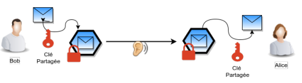
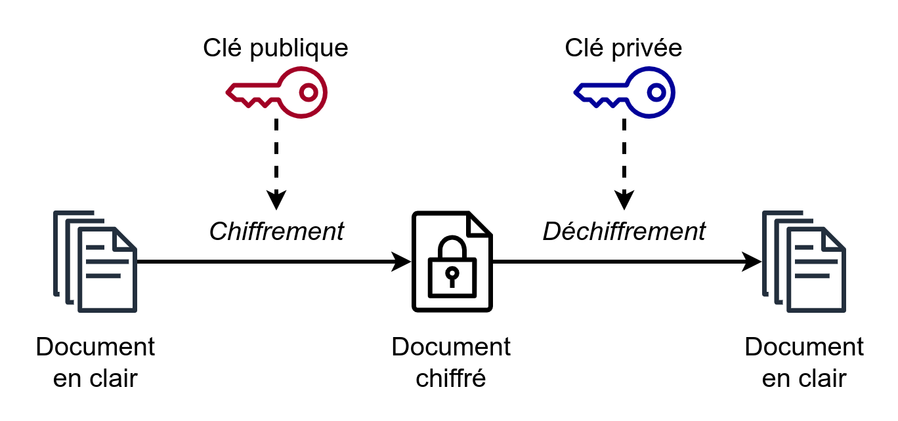
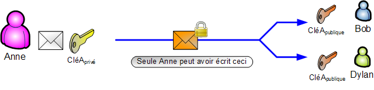

# Chapitre C.4 - Sécurisation des communications

La sécurisation des communications est un aspect fondamental de la protection des données échangées sur les réseaux. Elle vise à garantir que les informations transmises restent confidentielles, intègres et authentiques, empêchant ainsi tout accès non autorisé ou modification malveillante.

## I. Définition
- **Cryptographie :** La cryptographie est la science de la protection des informations en les transformant en un format illisible pour toute personne non autorisée. Elle utilise des algorithmes mathématiques pour chiffrer et déchiffrer les données, assurant ainsi leur confidentialité, intégrité et authenticité.
- **Chiffrer :** Chiffrer consiste à convertir des informations lisibles en un format illisible à l'aide d'un algorithme de chiffrement et d'une clé.
- **Déchiffrer :** Déchiffrer consiste à convertir des informations chiffrées en un format lisible à l'aide d'un algorithme de déchiffrement et d'une clé.
- **Clé de chiffrement/déchiffrement :** Une clé de chiffrement/déchiffrement est une valeur secrète utilisée par un algorithme de chiffrement pour convertir des informations lisibles en un format illisible (chiffrement) et pour les reconvertir en un format lisible (déchiffrement).
- **Décrypter :** Décrypter consiste à convertir des informations chiffrées en un format lisible sans connaître la clé de déchiffrement, souvent par des moyens non autorisés.
- **Coder et décoder :** Coder consiste à transformer des informations en un autre format selon un schéma connu, tandis que décoder consiste à revenir au format original en suivant le schéma inverse. (Exemple : codage des nombres en binaire)

> L'anglicisme "crypter" est à proscrire car il signifierait convertir des informations lisibles en un format illisible sans clé de chiffrement, ce qui est impossible

## II. Principe de chiffrement symétrique
Un chiffrement est dit symétrique lorsque la clé permettant de chiffrer un message est identique à la clé permettant de le déchiffrer.

### A. Le code césar, plus ancien code symétrique

Le code César est l'un des plus anciens et des plus simples systèmes de chiffrement. Il tire son nom de Jules César, qui l'utilisait pour ses communications militaires. Le principe du code César est de décaler chaque lettre du message d'un certain nombre de positions dans l'alphabet.

Dans le cas du code césar, la clé de chiffrement correspond aux nombres de positions à décaler

#### 1. Exemple de chiffrement avec la clé 3 :
- Message original : `BONJOUR`
- Message chiffré : `ERQMRXU`

Pour chiffrer le message, chaque lettre est remplacée par la lettre située trois positions plus loin dans l'alphabet. Pour déchiffrer le message, il suffit de faire l'opération inverse, c'est-à-dire de décaler chaque lettre de trois positions en arrière.

#### 2. Avantages et inconvénients :
- **Avantages :**
  - Simple à comprendre et à implémenter.
  - Rapide à exécuter.

- **Inconvénients :**
  - Très faible sécurité, facilement cassable par une analyse de fréquence ou une recherche exhaustive.
  - Ne convient pas pour protéger des informations sensibles.

> **Exercice 1 :**
> 
> Chiffrez le message suivant en utilisant le code César avec une clé de 4 :
> 
> - Message original : `HELLO WORLD`
> - Message chiffré : `____ ____`
> 
> Déchiffrez le message suivant en utilisant le code César avec une clé de 5 :
> 
> - Message chiffré : `MJQQT BTWQI`
> - Message original : `____ ____`

> **Exercice 2 :**
> 
> Écrivez deux fonction Python `chiffrer` et `déchiffrer` prenant un texte et une clé en paramètre et permettant de chiffrer et de déchiffrer un message en utilisant le code César.
>
> **Aide :**
> 
> - La fonction `ord` permet d'obtenir le code ASCII d'un caractère. Par exemple, `ord('A')` retourne 65.
> - La fonction `chr` permet de convertir un code ASCII en caractère. Par exemple, `chr(65)` retourne 'A'.

### B. Le chiffrement XOR
Cette méthode repose sur l’opérateur logique XOR (ou exclusif) et sur la répétition d’une clé alphanumérique.

> **Exercice 3 :**
> 
> 1. Écrivez la table de vérité de l'opérateur `XOR`.
> 2. On considère les entiers `x = 108` et `y = 84`. Donnez la représentation binaire non signée sur 8 bits de `x` et de `y`. Puis calculez bit à bit la valeur binaire de `z = x XOR y`.
> 3. Montrez que `z XOR x = y` et que `z XOR y = x`.
> 4. À quels caractères correspondent les entiers `x`, `y` et `z` en codage Unicode ?
> 5. Considérez le message `m = "Vive la NSI"` et une clé alphanumérique `k = "BIT"`. Créez une chaîne de caractères `c`, la clé augmentée, de même longueur que le message à chiffrer par répétition de la clé :
>    - `m = "Vive la NSI"`
>    - `c = "BITBITBITBI"`  
>    Convertissez chaque caractère du message `m` et de la clé augmentée `c` en son code Unicode (utilisez la fonction `ord` en Python).
> 6. Appliquez l’opération XOR caractère par caractère, et donnez la suite d’entiers obtenus.
> 7. Donnez la suite de caractères obtenue après chiffrement. Attention, certains caractères ne sont pas imprimables (comme ceux dont le code Unicode est inférieur à 32). Laissez-les apparaître sous leur code hexadécimal de la table Unicode.

### C. Quels sont les chiffrements symétriques utilisés aujourd'hui en informatique ?
Il existe de nombreux algorithmes de chiffrement symétrique parmi lesquels on peut citer : 
- **DES (Data Encryption Standard)** avec clés de 56 bits, soit 2^56 clés possibles. Il est obsolète de nos jours. 
- **AES (Advanced Encryption Standard)** avec clés de 128 bits minimum, soit 2^128 ≈ 3,4 ×10^38 clés possibles. C’est l’un des standards actuels.

Avec l’accroissement de la puissance de calcul des ordinateurs et l’amélioration des techniques de décryptage, certains de ces algorithmes sont devenus obsolètes (DES). Plus les ordinateurs se perfectionnent, et plus les algorithmes s’affaiblissent, obligeant à étudier de nouvelles solutions. 

C’est ainsi que la cryptographie évolue pour vaincre la cybermenace. Une clé est représentée par un nombre de bits fixés. Pendant longtemps une clé d’une quarantaine de bits à été suffisante mais de nos jours, le standard est maintenant de 128 bits mais il existe des systèmes permettant de monter jusqu’à 4 096 bits.

### D. Avantages et inconvénients

#### Avantages :
- **Rapidité :** Les algorithmes de chiffrement symétrique sont généralement plus rapides que les algorithmes asymétriques.
- **Efficacité :** Ils nécessitent moins de ressources informatiques, ce qui les rend adaptés pour chiffrer de grandes quantités de données.
- **Simplicité :** La gestion d'une seule clé pour le chiffrement et le déchiffrement simplifie le processus.

#### Inconvénients :
- **Distribution des clés :** Le principal défi est la distribution sécurisée des clés. Si la clé est interceptée, la sécurité du système est compromise.
- **Scalabilité :** Dans un réseau avec de nombreux utilisateurs, la gestion des clés devient complexe, car chaque paire d'utilisateurs nécessite une clé unique.
- **Sécurité :** Si la clé est compromise, toutes les communications chiffrées avec cette clé peuvent être déchiffrées.

## III. Principe de chiffrement asymétrique

Le chiffrement asymétrique, également appelé chiffrement à clé publique, utilise une paire de clés : une clé publique et une clé privée. La clé publique est utilisée pour chiffrer les données, tandis que la clé privée correspondante est utilisée pour les déchiffrer. Contrairement au chiffrement symétrique, les deux clés sont différentes, mais liées mathématiquement.

### A. Fonctionnement du chiffrement asymétrique

1. **Génération des clés :** Une paire de clés (publique et privée) est générée. La clé publique peut être partagée librement, tandis que la clé privée doit rester secrète.
2. **Chiffrement :** Lorsqu'une personne souhaite envoyer un message sécurisé, elle utilise la clé publique du destinataire pour chiffrer le message.
3. **Déchiffrement :** Le destinataire utilise sa clé privée pour déchiffrer le message chiffré.

### B. Avantages et inconvénients

#### Avantages :
- **Sécurité de la clé :** La clé privée ne doit jamais être partagée, ce qui réduit le risque de compromission.
- **Distribution des clés :** La clé publique peut être distribuée librement, simplifiant la gestion des clés.

#### Inconvénients :
- **Lenteur :** Les algorithmes de chiffrement asymétrique sont généralement plus lents que les algorithmes symétriques.
- **Complexité :** La génération et la gestion des paires de clés peuvent être plus complexes.

### C. Algorithmes de chiffrement asymétrique courants

- **RSA (Rivest-Shamir-Adleman) :** L'un des algorithmes de chiffrement asymétrique les plus utilisés, basé sur la difficulté de factoriser de grands nombres premiers.
- **ECC (Elliptic Curve Cryptography) :** Utilise les propriétés des courbes elliptiques pour offrir une sécurité équivalente à RSA avec des clés plus courtes.

Le chiffrement asymétrique est souvent utilisé en combinaison avec le chiffrement symétrique pour bénéficier des avantages des deux méthodes. Par exemple, le chiffrement asymétrique peut être utilisé pour échanger une clé symétrique, qui est ensuite utilisée pour chiffrer les données.

## IV. Échange d'une clé symétrique à partir d'une clé asymétrique

L'échange d'une clé symétrique à partir d'une clé asymétrique permet de combiner les avantages des deux types de chiffrement. Voici comment cela fonctionne :

> **Exercice 4 :**
> 
> Faites un schéma expliquant comment l'échange de clés peut se faire en utilisant une clé asymétrique pour sécuriser une clé symétrique. Le schéma doit inclure les étapes de génération, chiffrement, envoi et déchiffrement de la clé symétrique.

## V. Signature électronique.
Il est possible d'utiliser le système de chiffrement asymétrique pour signer un document éléctronique. C'est à dire s'assurer que le message a bien été écris par l'expéditeur. 

Pour cela, on utilise la clé privée pour chiffrer le message et la clé publique pour le déchiffrer.

