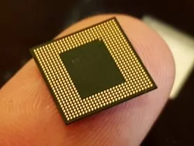
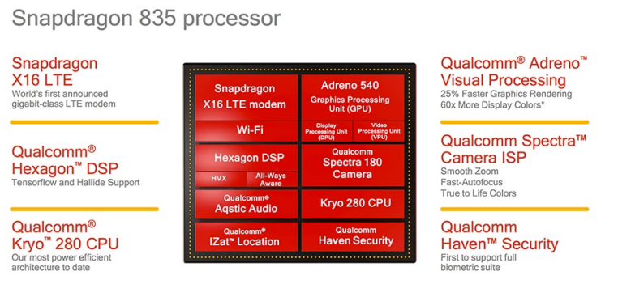
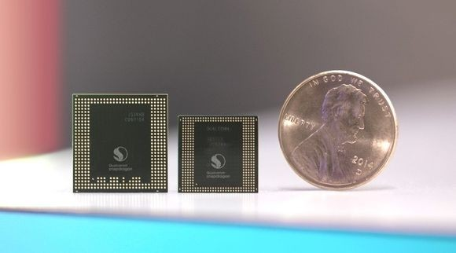

# Chapitre C.5 - Systèmes sur puces
## I. Introduction
Dans un ordinateur, il existe une multitude de composants nécessaire à son fonctionnement. Le processeur, différentes cartes (carte son, réseau, graphiques, etc…) ainsi que différents types de mémoires. Tous ces éléments sont directement branchés sur la carte mère qui permet de faire le lien entre tous ces composants.

On entend souvent dire que les smartphones sont de véritables ordinateurs. On peut alors s’interroger sur la taille d’un smartphone en comparaison avec un ordinateur. En effet, une carte-mère mesure environ 20 cm sur 30 cm ce qui est beaucoup plus petit qu’une carte-mère et pourtant un smartphone comprend les mêmes éléments qu’un ordinateur.

Pour placer tous les éléments dans un smartphone, on utilise un système sur puce.

## II Définition

Un Système sur puce (ou SoC – System on Chip) est un système sur une unique puce électronique qui regroupe différents composants d’un ordinateur tels que le processeur, la mémoire, les interfaces, bus de communications.

## III. Composants d'un système sur puce
- Le processeur (CPU – Central Processing Unit)

    Actuellement, la gravure de celui-ci est pratiquée avec une finesse de 10 nanomètre (10^(-9) mètre). Un processeur à un seul cœur ne traite qu’une instruction à la fois, certains d’entre eux sont plusieurs cœurs ce qui permet de les faire travailler séparément et de gagner en rapidité. Deux programmes peuvent utilisent deux cœurs différents, néanmoins ils doivent se partager les différentes mémoires du processeur.

    La rapidité d’un processeur est principalement lié à sa fréquence, au nombre de cœur et la taille de sa mémoire cache.

    La fréquence donne le nombre d’instructions pouvant être traitées en une seconde par cœur.

    D’autres facteurs interviennent également comme la vitesse du BUS principal.

- Le processeur graphique (GPU – Graphics Processing Unit) Il assure les calculs pour l’affichage des images à l’écran.

- Différents types mémoires : 
  - ROM, RAM, FLASH etc…

- D’autres composants : 
  - Modems
  - Circuits radio (WIFI, Bluetooth)
  - Une puce GPS
  - Des ports d’entrées/sorties
  - Des capteurs
  - …

**Exemple :**

## IV. Avantages et inconvénients d'un système sur puce
### Avantages

- Faible consommation énergétique : 
    
    Cela permet d’économiser de la  batterie et d’éviter la présence d’un ventilateur

- Vitesse de traitement et efficacités accrues : 
   
   Les distances sont réduites entre les composants, les données circulent donc plus rapidement

- Faible coût de fabrication et d’industrialisation

    Ils sont produits en très grande quantité et ne nécessite pas d’assemblage manuel

- Silencieux
    
    Ne nécessite pas de ventilateur

- Faible encombrement

### Inconvénients
- Pas d'évolution possible
  
    Les éléments qui composent un système sur puce sont gravés ensemble.

- Durée de vie et fiabilité :

    Le premier élément d’un système sur puce à présenter un dysfonctionnement provoquera une altération complète de la puce.