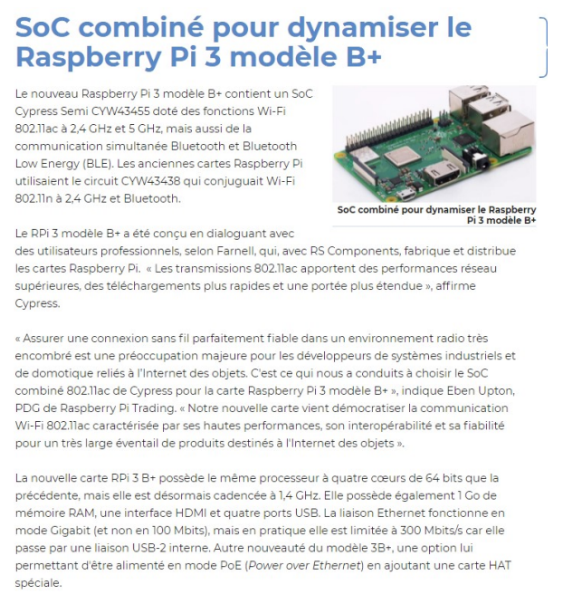

# Fiche d'exercices - C.4 - Systèmes sur puce

## Exercice 1
Classer les périphériques suivants selon leur nature : entrée, sortie ou entrée/sortie. 

|||||
|-|-|-|-|
|Clavier|	Lecteur / Graveur DVD|	Casque VR|	Micro|
|Ecran|	Imprimante|	Haut-parleur|	Ecran tactile|
|Souris|	Webcam|	clé USB|	Disque dur|

## Exercice 2
Faire une recherche sur l’architecture de Von Neumann et répondre aux questions suivantes : 

1. Faire le schéma de l’architecture de Von Neumann en faisant apparaître les communications entre les différents éléments.
2. Quelles composantes de l’architecture de Von Neumann sont comprises dans le processeur ?
3. Quelles composantes de l’architecture de Von Neumann sont comprises dans un système sur puce ?
4.	Classer les types de mémoire suivant : RAM, registres, disques durs, mémoire cache.
   - Par taille : 
   - Par rapidité :

## Exercice 3 
Donner la signification des acronymes suivants : 
-	RAM : 
-	CPU : 
-	ROM : 
-	SOC : 

## Exercice 4
Relever les différentes caractéristiques du SoC présent sur le RaspBerry Pi 3 modèle B+ à partir de l’article suivant :

