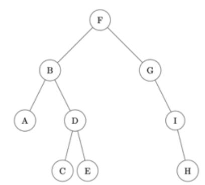
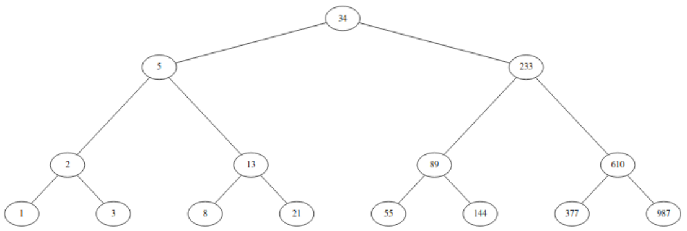

# TP Parcours d'arbre

Il existe plusieurs façons de parcourir un arbre binaire. 

Pour chacun des exercices, on prendre l'arbre exemple ci-dessous :



## A. Parcours préfixe
Sur l'arbre exemple, le résultat du parcours préfixe est : ```F, B, A, D, C, E, G, I, H```

1. Analyser le parcours de l'arbre exemple, donner le parcours préfixe de son sous-arbre gauche et de son sous-arbre droit.

2. Donner le parcours préfixe de l'arbre suivant :



3. Comment est construit le parcours de l'arbre en fonction de ses deux sous-arbre ?

4. En déduire un algorithme récursif permettant de réaliser un parcours préfixe d’un arbre passé en paramètre

5. Écrire la fonction ```parcours_prefixe``` (La fonction renvoie la liste des valeurs des noeuds).

## B. Parcours infixe
Sur l'arbre exemple, le résultat du parcours infixe est : ```A, B, C, D, E, F, G, I, H```

1. Analyser le parcours de l'arbre exemple, donner le parcours infixe de son sous-arbre gauche et de son sous-arbre droit.

2. Donner le parcours infixe de l'arbre suivant :


3. Comment est construit le parcours de l'arbre en fonction de ses deux sous-arbre ?

4. En déduire un algorithme récursif permettant de réaliser un parcours infixe d’un arbre passé en paramètre

5. Écrire la fonction ```parcours_infixe``` (La fonction renvoie la liste des valeurs des noeuds).

## C. Parcours suffixe
Sur l'arbre exemple, le résultat du parcours suffixe est : ```A, C, E, D, B, H, I, G, F```

1. Analyser le parcours de l'arbre exemple, donner le parcours suffixe de son sous-arbre gauche et de son sous-arbre droit.

2. Donner le parcours suffixe de l'arbre suivant :


3. Comment est construit le parcours de l'arbre en fonction de ses deux sous-arbre ?

4. En déduire un algorithme récursif permettant de réaliser un parcours suffixe d’un arbre passé en paramètre

5. Écrire la fonction ```parcours_suffixe``` (La fonction renvoie la liste des valeurs des noeuds).

## D. Parcours en largeur d'abord
Sur l'arbre exemple, le résultat du parcours en largeur d'abord est : ``` F, B, G, A, D, I, C, E, H```

1. Analyser le parcours de l'arbre exemple, donner le parcours en largeur d'abord de son sous-arbre gauche et de son sous-arbre droit.

2. Donner le parcours en largeur d'abord de l'arbre suivant :


3. Comment est construit le parcours de l'arbre en fonction de ses deux sous-arbre ?

5. Écrire la fonction ```parcours_en_largeur``` (La fonction renvoie la liste des valeurs des noeuds).

Cette fonction n'est pas récursive, vous avez besoin d'utiliser une file pour réaliser cet algorithme.
