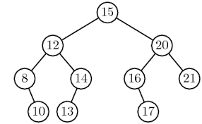

# Chapitre E.3 : Algorithmes sur les arbres binaires de recherche

## I. Qu'est-ce qu'un arbre binaire de recherche ?


**Définition :**
Un arbre binaire de recherche est un arbre binaire dont les éléments sont ordonnés.
- Chaque noeud du sous-arbre gauche est inférieur ou égal à la racine.
- Chaque noeud du sous-arbre droit est supérieur ou égal à la racine.
- Le sous-arbre gauche est un arbre binaire de recherche.
- Le sous arbre droit est un arbre binaire de recherche.
- L'arbre vide est un arbre binaire de recherche.

## II. Fonction ```est_arbre_binaire_de_recherche```
