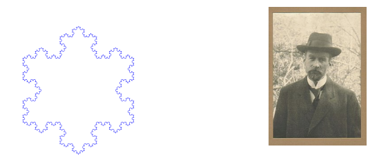
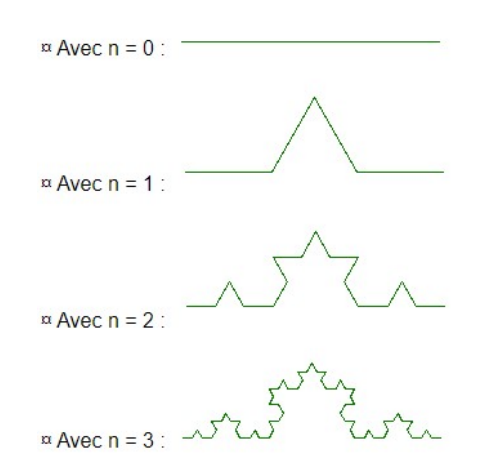
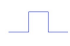
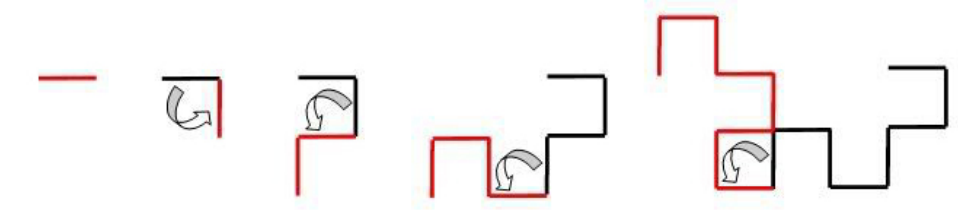

# PROJET 1 – FLOCON DE VON KOCH
## Le projet
Le flocon de Von Koch est l‘une des premières courbes fractales à avoir été décrite.

Elle a été inventée en 1904 par la mathématiciens suédois Edge Von Koch


L’objectif de ce projet est d’afficher le flocon de Von Koch à l’aide de la bibliothèque turtle

## Etape 1
Charger le module turtle

Tester les fonctions : ```forward(200)```, ```left(90)```, ```right(200)```, ```forward(-300)```, ```up()```, ```goto(-100, 100)```, ```down()``` et ```goto(150, 200)```.

A l’aide de fonctions de ce module, écrire une fonction qui dessine un triangle équilatéral de côté c puis une fonction qui dessine un carré de côté c (pour accélérer l’affichage, on utilisera speed(0) au début du programme).

> Appeler l’enseignant pour lui montrer votre travail ! 

## Etape 2
On commence par chercher à construire une seule ligne du flocon (ligne de Von Koch) de profondeur ```n```.


Par exemple :



1. Quel est le cas de base ? Que fait-on dans ce cas ? (Il faut utiliser turtle)
2. Combien d’étape sont nécessaires pour passer d’un segment de profondeur n-1 au suivant ?
3. Écrire la fonction récursive ```ligneVonKoch(longueur, n)``` qui prend deux paramètres : longueur la longueur initiale du segment et n la profondeur et qui trace (à l’aide de turtle) une ligne de Von Koch.

> Appeler votre enseignant pour lui montrer votre travail !


## Etape 3
1. Écrire la fonction ```floconVonKoch(longueur, n)``` qui prend en paramètre ```longueur``` et ```n``` et qui utilise la fonction ```ligneVonKoch``` pour tracer le flocon de Von Koch de profondeur n (et pour la longueur longueur de côté du triangle équilatéral)   

> Appeler votre enseignant pour lui montrer votre travail ! 

## Etape 4
1. Écrire un principe de construction analogue pour que le cas n=1 devienne :



## Etape 5 - BONUS
La courbe du dragon (ou « Fractale du dragon » ou « courbe de Heighway » ou « dragon de Heighway ») a été pour la première fois étudiée par les physiciens de la NASA John Heighway, Bruce Banks, et William Harter. Elle a été décrite par Martin Gardner dans sa chronique de jeux mathématiques du Scientific American en 1967. 

La courbe du dragon se construit ainsi :



1. Écrire une fonction récursive permettant de dessiner la courbe du dragon de profondeur ```n```.
 
