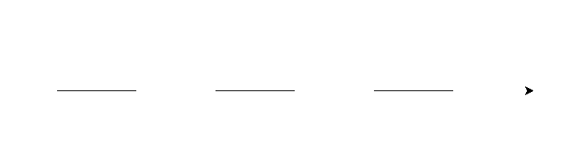
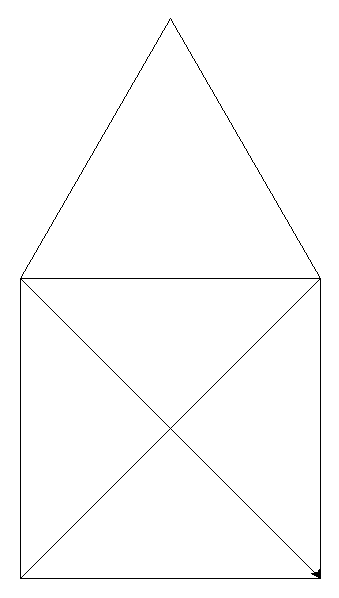

# TP - SNT - PYTHON

## Exercice 1
Recopier et exécuter le code suivant :
```python
from turtle import *

forward(50)
left(30)
forward(50)

```
1. Dessiner le résultat obtenu sur votre copie
2. Déterminer le rôle des fonctions ```forward``` et ```left```.

Recopier et exécuter le code suivant : 
```python
from turtle import *

forward(50)
up()
forward(50)
down()
forward(50)
```
1. Dessiner le résultat obtenu sur votre copie
2. Déterminer le rôle des fonctions ```up``` et ```down```.

## Exercice 2 
Le code suivant permet de dessiner un triangle équilatérale de longueur 100. Compléter les ```...``` pour qu'il soit fonctionnelle.

```python
from turtle import * 

for loop in range(3):
    ...
    left(120)
```

## Exercice 3
En vous aidant de l'exercice 2, proposer un code python permettant de dessiner un carré de longueur 50.

## Exercice 4
Compléter le code python permettant d'obtenir le dessin suivant : 



```python
from turtle import *

for loop in range(...):
    forward(100)
    ...
    ...
    down()
```


## Exercice 5
Ecrire un code python permettant d'obtenir le dessin suivant :


