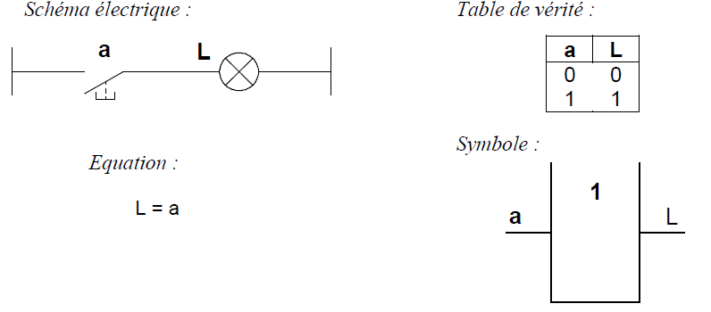
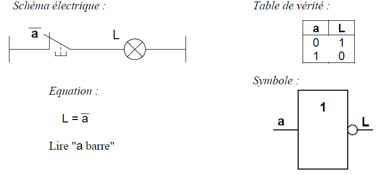
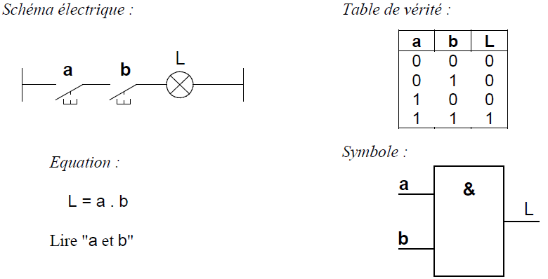
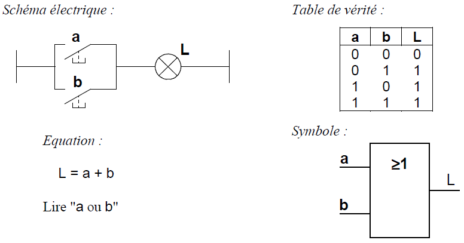
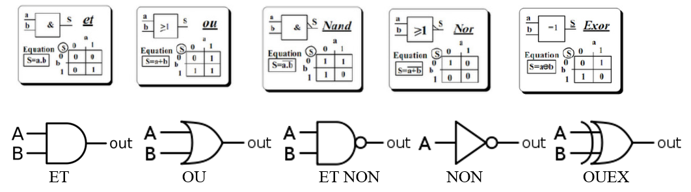

# La logique booléenne
## Introduction à la logique booléenne

La logique booléenne est une branche des mathématiques qui s'intéresse aux valeurs de vérité. Elle est fondamentale en informatique et en électronique, car elle permet de concevoir et d'analyser des circuits logiques et des algorithmes.

## Les variables booléennes

Une variable booléenne ne peut prendre que deux valeurs : `Vrai` (1) ou `Faux` (0). Ces valeurs sont également appelées `True` et `False` en anglais.

## Les opérateurs logiques
1. **OUI** : L'opératuer OUI conserve la valeur de vérité de l'opérande.
    - Exemple : `OUI A` est vrai si `A` est vrai

2. **NON ($\overline{a}$)** : L'opérateur NON inverse la valeur de vérité de l'opérande.
    - Exemple : `NON A` est vrai si `A` est faux.

3. **ET ($\cdot$)** : L'opérateur ET est vrai si et seulement si les deux opérandes sont vrais.
    - Exemple : `A ET B` est vrai si `A` est vrai et `B` est vrai.

4. **OU ($+$)** : L'opérateur OU est vrai si au moins un des opérandes est vrai.
    - Exemple : `A OU B` est vrai si `A` est vrai ou `B` est vrai (ou les deux).

5. **ET NON** : L'opérateur ET NON est vrai si au moins l'un des deux est vrai.
    - Exemple : `A ET NON B` est vrai si `A` est faux ou `B` est faux (ou les deux)

6. **OU NON** : L'opérateur OU NON est vrai si les deux sont faux.
    - Exemple : `A OU NON B` est vrai si `A` et `B` sont faux.

7. **OU EXCLUSIF (\oplus)** L'opérateur OU EXCLUSIF est vrai l'un est vrai mais pas l'autre.
    - Exemple : `A XOR B` est vrai si `A` est vrai ou `B` est vrai (maix pas les deux)

### Autres représentations

## Les expressions booléennes
### De l'expression à la table de vérité :

Prenons l'expression booléenne suivante : $\overline{( A \cdot (B + \overline{C}))}$

| A   | B   | C   | $\overline{c}$| $B + \overline{c}$| $\overline{( A \cdot (B + \overline{C}))}$|
|-----|-----|-----|---------------|-------------------|-------------------------------------------|
| 0   | 0   | 0   | 1             | 1                 | 0                                         |
| 0   | 0   | 1   | 0             | 0                 | 0                                         |
| 0   | 1   | 0   | 1             | 1                 | 0                                         |
| 0   | 1   | 1   | 0             | 1                 | 0                                         |
| 1   | 0   | 0   | 1             | 1                 | 1                                         |
| 1   | 0   | 1   | 0             | 0                 | 0                                         |
| 1   | 1   | 0   | 1             | 1                 | 1                                         |
| 1   | 1   | 1   | 0             | 1                 | 1                                         |

### De la table de vérité à l'expression booléenne
Prenons la table de vérité suivante :

| A   | B   | F   |
|-----|-----|-----|
| 0   | 0   | 0   |
| 0   | 1   | 1   |
| 1   | 0   | 1   |
| 1   | 1   | 0   |

Pour trouver l'expression booléenne correspondant à cette table de vérité, nous devons identifier les lignes où la sortie `F` est vraie (1).

- Pour la ligne `A=0` et `B=1`, `F` est vrai.
- Pour la ligne `A=1` et `B=0`, `F` est vrai.

L'expression booléenne est donc la somme des produits des conditions où `F` est vrai :

$F = (\overline{A} \cdot B) + (A \cdot \overline{B})$

Cette expression peut également être représentée par l'opérateur OU EXCLUSIF (XOR) :

$ F = A \oplus B $

### Tableau de Karnaugh
Le tableau de Karnaugh est un outil visuel utilisé pour simplifier les expressions booléennes. Il permet de regrouper les termes similaires et de minimiser le nombre de termes dans une expression.

## Tableau de Karnaugh

Le tableau de Karnaugh est un outil visuel utilisé pour simplifier les expressions booléennes. Il permet de regrouper les termes similaires et de minimiser le nombre de termes dans une expression.

### Utilisation du tableau de Karnaugh
|b	|a	|S1|
|---|---|--|
|0	|0	|0 |
|0	|1	|1 |
|1	|0	|1 |
|1	|1	|1 |

Pour simplifier une expression booléenne à l'aide d'un tableau de Karnaugh, nous devons suivre les étapes suivantes :

1. Construire le tableau de Karnaugh pour l'expression booléenne.
Il est fonction de la table de vérité, le Nb de case égale le Nb de combinaisons.

||||
|---|-|-|
|b\a|0|1|
|0|0|1|
|1|1|1|

2. Regrouper les 1 adjacents en blocs de tailles maximales (1, 2, 4, 8, etc.).

3. Écrire l'expression simplifiée en fonction des blocs formés.
Les ‘1’ indiquent les solutions.

$   = B1 + B2$                 (B1 et B2 : Boucles de solution)

$   = a \overline{b} + ab     +    ab + \overline{a}b$

$   =         a          +          b$	

**Exemple :**
|c	|b	|a	|S2|
|---|---|---|--|
|0	|0	|0	|0 |
|0	|0	|1	|1 |
|0	|1	|0	|0 |
|0	|1	|1	|1 |
|1	|0	|0	|0 |
|1	|0	|1	|0 |
|1	|1	|0	|0 |
|1	|1	|1	|1 |

